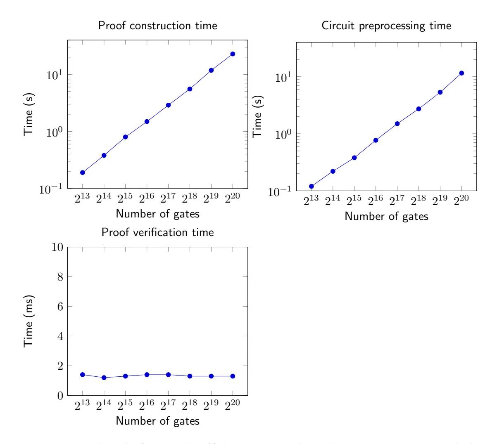

# PlonK: Permutations over Lagrange-bases for Oecumenical Noninteractive arguments of Knowledge

Ariel Gabizon\* Aztec

Zachary J. Williamson Aztec

Oana Ciobotaru Pi Squared

March 27, 2025

### Abstract

zk-SNARK constructions that utilize an updatable universal structured reference string remove one of the main obstacles in deploying zk-SNARKs[\[GKM](#page-32-0)+]. The important work of Maller et al. [\[MBKM19\]](#page-32-1) presented Sonic - the first potentially practical zk-SNARK with fully succinct verification for general arithmetic circuits with such an SRS. However, the version of **Sonic** enabling fully succinct verification still requires relatively high proof construction overheads. We present a universal SNARK construction with fully succinct verification, and significantly lower prover running time (roughly 7.5-20 times fewer group exponentiations than [\[MBKM19\]](#page-32-1) in the fully succinct verifier mode depending on circuit structure).

Similarly to [\[MBKM19\]](#page-32-1) we rely on a permutation argument based on Bayer and Groth [\[BG12\]](#page-31-0). However, we focus on "Evaluations on a subgroup rather than coefficients of monomials"; which enables simplifying both the permutation argument and the arithmetization step.

## 1 Introduction

Due to real-world deployments of zk-SNARKs, it has become of significant interest to have the structured reference string (SRS) be constructible in a "universal and updatable" fashion. Meaning that the same SRS can be used for statements about all circuits of a certain bounded size; and that at any point in time the SRS can be updated by a new party, such that the honesty of only one party from all updaters up to that point is required for soundness. For brevity, let us call a zk-SNARK with such a setup process universal.

For the purpose of this introduction, let us say a zk-SNARK for circuit satisfiability is fully succinct if

\*Most of this work was done while the first author was working at Protocol Labs.

- [1](#page-1-0). The preprocessing  $\frac{1}{2}$  phase/SRS generation run time is quasilinear in circuit size.
- 2. The prover run time is quasilinear in circuit size.
- 3. The proof length is logarithmic[2](#page-1-1) in circuit size.
- 4. The verifier run time is polylogarithmic in circuit size.[3](#page-1-2)

Maller et al. [\[MBKM19\]](#page-32-1) constructed for the first time a universal fully succinct zk-SNARK for circuit satisfiability, called Sonic.

[\[MBKM19\]](#page-32-1) also give a version of Sonic with dramatically improved prover run time, at the expense of efficient verification only in a certain amortized sense.

## 1.1 Our results

In this work we give a universal fully-succinct zk-SNARK with significantly improved prover run time compared to fully-succinct Sonic.

At a high level our improvements stem from a more direct arithmetization of a circuit as compared to the  $[BCC^+16]$  $[BCC^+16]$ -inspired arithmetization of [\[MBKM19\]](#page-32-1). This is combined with a permutation argument over univariate evaluations on a multiplicative subgroup rather than over coefficients of a bivariate polynomial as in [\[MBKM19\]](#page-32-1).

In a nutshell, one reason multiplicative subgroups are useful is that several protocols, including Sonic, use a permutation argument based on Bayer and Groth [\[BG12\]](#page-31-0). Ultimately, in the "grand product argument", this reduces to checking relations between coefficients of polynomials at "neighbouring monomials".

We observe that if we think of the points  $x, \mathbf{g} \cdot x$  as neighbours, where **g** is a generator of a multiplicative subgroup of a field  $\mathbb{F}$ , it is very convenient to check relations between different polynomials at such pairs of points.

A related convenience is that multiplicative subgroups interact well with Lagrange bases. For example, suppose  $H \subset \mathbb{F}$  is a multiplicative subgroup of order n, and  $x \in H$ . The polynomial  $L_x$  of degree  $n-1$  that vanishes on  $H \setminus \{x\}$  and has  $L_x(x) = 1$ , has a very sparse representation of the form

$$
L_x(X) = \frac{c_x(X^n - 1)}{(X - x)},
$$

for a constant  $c_x$ . This is beneficial when constructing an efficiently verifiable [\[BG12\]](#page-31-0)style permutation argument in terms of polynomial identities.

&lt;sup>1We use the term SNARK in this paper for what is sometimes called a "SNARK with preprocessing"(see e.g. [\[GGPR13\]](#page-32-2)) where one allows a one-time verifier computation that is polynomial rather than polylogarithmic in the circuit size. In return, the SNARK is expected to work for all non-uniform circuits, rather than only statements about uniform computation.

2From a theoretical point of view, polylogarithmic proof length is more natural; but logarithmic nicely captures recent constructions with a constant number of group elements, and sometimes is a good indication of the "practicality barrier".

&lt;sup>3In many definitions, only proof size is required to be polylogarithmic. For example, in the terminology of [\[GGPR13\]](#page-32-2), additionally requiring polylogarithmic verifier run time means the SNARK is unsubtle.

## 1.2 Efficiency Analysis

We compare the performance of this work to the state of the art, both for non-universal SNARKs and universal SNARKs. At the time of publication, the only fully succinct universal SNARK construction is (the fully-succinct version of) the Sonic protocol [\[MBKM19\]](#page-32-1). This protocol requires the prover compute 273n  $\mathbb{G}_1$  group exponentiations, where n is the number of multiplication gates. In fully-succinct Sonic, every wire can only be used in three linear relationships, requiring the addition of 'dummy' multiplication gates to accommodate wires used in more than three addition gates. This increase in the multiplication gate count is factored into the prover computation estimate (see [\[MBKM19\]](#page-32-1) for full details).

Our universal SNARK requires the prover to compute 5 polynomial commitments, combined with two opening proofs to evaluate the polynomial commitments at a random challenge point. There are two "flavours" of  $P$ lon $K$  to suit the tastes of the user. By increasing the proof size by two group elements, the total prover computations can be reduced by  $\approx 10\%$ . The combined degree of the polynomials is either  $9(n + a)$  (larger proofs) or  $11(n + a)$  (smaller proofs, reduced verifier work), where n is the number of multiplication gates and  $\alpha$  is the number of addition gates. Currently, the most efficient fully-succinct SNARK construction available is Groth's 2016 construction [\[Gro16\]](#page-32-3), which requires a unique, non-updateable CRS per circuit. Proof construction times are dominated by  $3n + m$  G1 and n G2 group exponentiations, where m is formally the number of R1CS variables, and is typically bounded by  $n$  (for the rest of this section, the reader may assume  $m = n$  for simplicity). If we assume that one  $\mathbb{G}_2$  exponentiation is equivalent to three  $\mathbb{G}_1$  exponentiations, this yields  $6n + m$  equivalent  $\mathbb{G}_1$  group exponentiations.

Performing a direct comparison between these SNARK arithmetisations requires some admittedly subjective assumptions. When evaluating common circuits, we found that the number of addition gates is 2x the number of multiplication gates, however circuits that are optimized under the assumption that addition gates are 'free' (as is common in R1CS based systems like [\[Gro16\]](#page-32-3)) will give worse estimates.

At one extreme, for a circuit containing no addition gates and only fan-in-2 multiplication gates, our universal SNARK proofs require  $\approx 1.1$  times more prover work than [\[Gro16\]](#page-32-3), and  $\approx 30$  times fewer prover work than Sonic. If  $a = 2n$ , the ratios change to  $\approx 2.25$  times more prover work than [\[Gro16\]](#page-32-3), and  $\approx 10$  times less work than Sonic. If  $a = 5n$ , this changes to  $\approx 3$  times more work than [\[Gro16\]](#page-32-3), and  $\approx 5$  times less work than Sonic. We should note that these comparisons are only comparing the required number of group exponentiations.

We also note that the degree of  $\mathcal{P}$ lon $\mathcal{K}$ 's structured reference string is equal to the number of gates in a circuit (if one uses the "fast" flavour of  $\mathcal{P}$ lon $\mathcal{K}$ ). This is a significant reduction in the SRS size compared to the state of the art.

When comparing proof construction, we also include the number of field multiplications for PlonK, as the number of fast-fourier-transforms required to construct proofs is non-trivial. All other succinct universal SNARK constructions also have high FFT

|                         | size $\leq d$ SRS                    | $size = n$ CRS/SRS                | prover work                                                      | proof length                   | succinct     | universal    |
|-------------------------|-----------------------------------------|--------------------------------------|---------------------------------------------------------------------|-----------------------------------|--------------|--------------|
| Groth'16                | -                                       | $3n+m$ G1                            | $3n+m-\ell$ G1 exp, $n \mathbb{G}_2$ exp                         | $2\mathbb{G}_1$ , $1\mathbb{G}_2$ | $\checkmark$ | $\times$     |
| Sonic (helped)          | $12d \mathbb{G}_1$ , $12d \mathbb{G}_2$ | $12n$ G1                             | $18n \mathbb{G}_1$ exp                                              | $4 \mathbb{G}_1$ , $2 F$          | $\times$     | $\checkmark$ |
| Sonic (succinct)        | $4d\mathbb{G}_1$ , $4d\mathbb{G}_2$     | $36n$ G1                             | $273n \mathbb{G}_1$ exp                                             | $20 \mathbb{G}_1$ , 16 F          | $\checkmark$ | $\checkmark$ |
| Auroralight             | $2d\mathbb{G}_1$ , $2d\mathbb{G}_2$     | $2n$ G1                              | $8n \mathbb{G}_1$ exp                                               | $6\mathbb{G}_1, 4 F$              | $\times$     | $\checkmark$ |
| This work (small)       | $3d\mathbb{G}_1$ , 1 $\mathbb{G}_2$     | $3n+3a \mathbb{G}_1, 1 \mathbb{G}_2$ | $11n + 11a \mathbb{G}_1 \exp$ , $\approx 54(n+a)\log(n+a)$ F mul | $7\mathbb{G}_1$ , 6 F             | $\checkmark$ | $\checkmark$ |
| This work (fast prover) | $d\mathbb{G}_1$ , 1 $\mathbb{G}_2$      | $n+a\mathbb{G}_1, 1\mathbb{G}_2$     | $9n + 9a$ G1 exp, $\approx 54(n+a)\log(n+a)$ F mul               | $9\mathbb{G}_1, 6F$               | $\checkmark$ | $\checkmark$ |

Table 1: Prover comparison.  $m =$  number of wires,  $n =$  number of multiplication gates,  $a =$  number of addition gates

transform costs, however given the difficulty of finding hard numbers, we cannot include them in the above table. Qualitative analysis suggests that the FFTs consume slightly less compute time than the  $\mathbb{G}_1$  group exponentiations. More details on the number of field multiplications are given in section [1.3.](#page-4-0)

Verifier computation per proof is shown in table [2.](#page-3-0) Only two bilinear pairing operations are required, due to the simple structure of the committed prover polynomials. In addition, the  $\mathbb{G}_2$  elements in each pairing are fixed, enabling optimizations that reduce pairing computation time by  $\approx 30\%$  [\[CS10\]](#page-32-4).

Table 2: Verifier comparison per proof,  $P=$ pairing,  $\ell$ =num of pub inputs. For nonsuccinct protocols, additional helper work is specified

|                         | verifier work           | elem. from helper | extra verifier work in helper mode |
|-------------------------|----------------------------|----------------------|------------------------------------------|
| Groth'16                | $3P, \ell G_1 \text{ exp}$ | -                    | -                                        |
| Sonic (helped)          | 10P                        | $3 G_1, 2 F$         | 4P                                       |
| Sonic (succinct)        | 13P                        | -                    | -                                        |
| Auroralight             | $5P, 6 G_1 \text{ exp}$    | $8 G_1, 10 F$        | 12P                                      |
| This work (small)       | $2P, 16 G_1 \text{ exp}$   | -                    | -                                        |
| This work (fast prover) | $2P, 18 G_1 \text{ exp}$   | -                    | -                                        |

## 1.3 Performance and Benchmarks

Figure 1: Benchmarks for test  $\mathcal{P}$ lon $\mathcal{K}$  circuits using the BN254 curve. Does not include witness generation. Tests performed on a Surface pro 6 with 16GB RAM and a core i7-8650U CPU, utilizing all 8 logical/4 physical cores.

Figure [1](#page-4-1) provides some estimates for the time required to construct and verify  $\mathcal{P}$ lon $\mathcal{K}$ proofs. The benchmarks in question utilize the BN254 elliptic curve, using the [Barreten](https://github.com/AztecProtocol/barretenberg)[berg ecc library.](https://github.com/AztecProtocol/barretenberg)

Even for circuits with over a million gates,  $\mathcal{P}$ lon $\mathcal{K}$  proofs are capable of being constructed on consumer-grade hardware in under 23 seconds. This marks a significant advancement in the efficiency of universal SNARKs, which are now practical for a wide range of real-world use-cases.

Circuit preprocessing is a one-off computation, required for each program codified into a  $P$ lon $K$  circuit. This step generates the polynomial commitments to the 'selector' polynomials required to verify proofs.

When constructing proofs, the time taken to perform the required fast fourier transforms is comparable to the time taken for elliptic curve scalar multiplications. The number of field multiplications in table [1](#page-3-1) is obtained from 8 FFTs of size  $4n$ , 5 FFTs of size  $2n$  and 12 FFTs of size n.

The number of FFT transforms can be significantly reduced, if a circuit's preprocessed polynomials are provided as evaluations over the  $4n2$  th roots of unity (instead of in Lagrange-base form). However, given this dramatically increases the amount of information required to construct proofs, we omit this optimisation from our benchmarks.

We conclude the introduction with a comparision to relevant concurrent work.

### 1.4 Comparison with the randomized sumcheck approach, and Fractal/Marlin:

Roughly speaking, all succinct proving systems work by using randomness to compress many constraint checks into one. The general way to obtain such compression, is by taking a random linear combination of the constraints. In the case of R1CS and similar systems, the more difficult constraints to be compressed are linear relations between the system variables, i.e. constraints of the form  $\langle a_i, x \rangle = 0$  where  $x \in \mathbb{F}^m$  are the system variables, and  $a_i \in \mathbb{F}^m$  represents one of the constraints.[4](#page-5-0)

These are analogous to the less general "wiring constraints" in a circuit satisfiability statement, which have the form  $x_i = x_j$  (e.g. when  $x_i$  represents the output wire of a gate  $G$ , and  $x_j$  an input wire from G into another gate  $G'$ ).

A random[5](#page-5-1) linear combination of linear constraints might have the form

$$
\sum_{i \in [n]} r^i < a_i, x > = 0
$$

for a unifrom  $r \in \mathbb{F}$ 

Skipping some details, [\[MBKM19\]](#page-32-1) and the subsequent work of [\[Gab19\]](#page-32-5) (relying on  $[BCR+19]$  $[BCR+19]$  reduce such a check to evaluating a degree *n* bivariate *S* at a random point; such that the number of non-zero monomials in S corresponds to the number of nonzero entries in the constraint vectors  ${a_i}_{i \in [n]}$ . [\[MBKM19\]](#page-32-1) at this point devise a clever strategy to amortize the cost of many evaluations of S across many proofs. This variant of [\[MBKM19\]](#page-32-1) is much more prover efficient, but not fully succinct because of the need for the verifier to compute at least one evaluation of S by themselves.

&lt;sup>4We emphasize that the vector  $a_i$  here does not precisely correspond to one of the r1cs matrix rows, but rather to a "flattening" of it, i.e. it is a constraint of the form  $y = \sum a'_{i,j} x_j$  where  $a'_i$  is one the r1cs matrix rows.

&lt;sup>5It is a standard derandomization trick to use powers of a single random  $r \in \mathbb{F}$  rather than random independent  $r_i$ .

Thus, the barrier to a fully succinct version of the more prover efficient version of Sonic (and for a fully succinct version of [\[Gab19\]](#page-32-5)), is a method to efficiently verify an evaluation  $S(z, y)$  in the case S only contains  $O(n)$  non-zero monomials.

A significant technical contribution of the recent[6](#page-6-0) concurrent Fractal and Marlin systems [\[CHM](#page-32-6)+19, [COS19\]](#page-32-7) is a solution to this problem "in Lagrange Basis".

Specifically, suppose that  $H, K$  are multiplicative subgroups of size  $O(n)$  of  $\mathbb F$  such that S has only M non-zero values on  $H \times K$ ; then [\[CHM](#page-32-6)+19, [COS19\]](#page-32-7) devise a protocol to convince a succinct verifier that  $S(z, y) = t$  where the prover's work is linear in M. This is a good point to note that the solution to this problem by the natural generalization of [\[KZG10\]](#page-32-8) to a bi-variate polynomial commitment scheme would have led to  $O(n^2)$ proving time.

Coming back to  $\mathcal{P}$ lon $\mathcal{K}$ , the reason we don't require this "bi-variate evaluation breakthrough" is that we focus on constant fan-in circuits rather than R1CS/unlimited addition fan-in; and thus our linear constraints are just wiring constraints that can be reduced to a permutation check (as explained in Sections [5.2,](#page-21-0) [6\)](#page-22-0). One way to interpret the [\[BG12\]](#page-31-0) technique is that "linear constraints that correspond to a permutation can be more simply combined than general linear constraints". For example, in the above equation each constraint is multiplied by a distinct random coefficient, whereas in the [\[BG12\]](#page-31-0) randomization, it suffices in a sense to add the same random shift to each variable value. (See the permutation protocol in Section [5](#page-18-0) for details.)

Concrete comparison to Marlin While Fractal leverages the sparse bi-variate evaluation technique in the context of transparent recursive SNARKs, Marlin focuses on constructing a fully succinct (universal) SNARK as in this paper.

It is not completely straightforward to compare this work and [\[CHM](#page-32-6)+19], as we are in the realm of concrete constants, and the basic measure both works use is different. While we take our main parameter  $n$  to be the number of addition and multiplication gates in a fan-in two circuit;  $[CHM^+19]$  $[CHM^+19]$  use as their main parameter the maximal number of non-zeroes in one of the three matrices describing an R1CS. For the same value of  $n$  $P$ lonK outperforms Marlin, e.g. by roughly a 2x factor in prover group operations and proof size. In the extreme case of a circuit with only multiplication gates, this would indeed represent the performance difference between the two systems.

However, in constraint systems with "frequent large addition fan-in" Marlin may outperform the currently specified variant[7](#page-6-1) of  $\mathcal{P}$ lon $\mathcal{K}$ . For example, this happens in the extreme case of one "fully dense" R1CS constraint

$$
\left(\sum_{j\in[m]}a_jx_j\right)\cdot\left(\sum_{j\in[m]}b_jx_j\right)=\sum_{j\in[m]}c_jx_j.
$$

where  $a, b, c \in \mathbb{F}^m$  have all non-zero entries.

&lt;sup>6In hindsight, we realized Spartan[\[Set\]](#page-32-9) gave a similar sparse evaluation scheme for multilinear poly-nomials prior to [\[CHM](#page-32-6)+19, [COS19\]](#page-32-7).

&lt;sup>7It seems that the natural variants of  $\mathcal{P}$ lon $\mathcal{K}$  where the addition fan-in is increased to three or four according to the instance could outperform the current numbers given in Marlin for any R1CS.

Morever, it seems ideas implicit in Fractal, or alternatively a "plug-in" of the mentioned sparse bi-variate evaluation protocol into [\[Gab19\]](#page-32-5) will lead to improved performance via this route; especially in cases where some of the prover work can be delegated to an outside helper (in  $\mathcal{P}$ lon $\mathcal{K}$  there is less opportunity for such delegation, as the wiring is checked on the witness itself, whereas in  $[Gab19, \text{CHM}^+19, \text{COS}19]$  $[Gab19, \text{CHM}^+19, \text{COS}19]$  it is in a sense checked on the random coefficients of the verifier).

## 2 Preliminaries

### 2.1 Terminology and Conventions

We assume our field  $\mathbb F$  is of prime order. We denote by  $\mathbb F_{\le d}[X]$  the set of univariate polynomials over  $\mathbb F$  of degree smaller than d. We assume all algorithms described receive as an implicit parameter the security parameter  $\lambda$ .

Whenever we use the term "efficient", we mean an algorithm running in time  $\mathsf{poly}(\lambda)$ . Furthermore, we assume an "object generator"  $\mathcal O$  that is run with input  $\lambda$  before all protocols, and returns all fields and groups used. Specifically, in our protocol  $\mathcal{O}(\lambda)$  =  $(\mathbb{F}, \mathbb{G}_1, \mathbb{G}_2, \mathbb{G}_t, e, g_1, g_2, g_t)$  where

- **F** is a prime field of super-polynomial size  $r = \lambda^{\omega(1)}$ .
- $\bullet$   $\mathbb{G}_1, \mathbb{G}_2, \mathbb{G}_t$  are all groups of size r, and e is an efficiently computable non-degenerate pairing  $e : \mathbb{G}_1 \times \mathbb{G}_2 \to \mathbb{G}_t$ .
- $g_1, g_2$  are uniformly chosen generators such that  $e(g_1, g_2) = g_t$ .

We usually let the  $\lambda$  parameter be implicit, i.e. write  $\mathbb F$  instead of  $\mathbb F(\lambda)$ . We write  $\mathbb G_1$ and  $\mathbb{G}_2$  additively. We use the notations  $[x]_1 := x \cdot g_1$  and  $[x]_2 := x \cdot g_2$ .

We often denote by [n] the integers  $\{1, \ldots, n\}$ . We use the acronym e.w.p for "except" with probability"; i.e. e.w.p  $\gamma$  means with probability at least  $1 - \gamma$ .

universal SRS-based public-coin protocols We describe public-coin (meaning the verifier messages are uniformly chosen) interactive protocols between a prover and verifier; when deriving results for non-interactive protocols, we implicitly assume we can get a proof length equal to the total communication of the prover, using the Fiat-Shamir transform/a random oracle. Using this reduction between interactive and non-interactive protocols, we can refer to the "proof length" of an interactive protocol.

We allow our protocols to have access to a structured reference string (SRS) that can be derived in deterministic  $poly(\lambda)$ -time from an "SRS of monomials" of the form  $\{[x^i]_1\}_{a\leq i\leq b}, \{[x^i]_2\}_{c\leq i\leq d}$ , for uniform  $x\in \mathbb{F}$ , and some integers  $a, b, c, d$  with absolute value bounded by  $\overline{\text{poly}}(\lambda)$ . It then follows from Bowe et al. [\[BGM17\]](#page-31-3) that the required SRS can be derived in a universal and updatable setup requiring only one honest participant; in the sense that an adversary controlling all but one of the participants in the setup does not gain more than a negl( $\lambda$ ) advantage in its probability of producing a proof of any statement.

For notational simplicity, we sometimes use the SRS srs as an implicit parameter in protocols, and do not explicitly write it.

## 2.2 Analysis in the AGM model

For security analysis we will use the Algebraic Group Model of Fuchsbauer, Kiltz and Loss[\[FKL18\]](#page-32-10). In our protocols, by an *algebraic adversary*  $A$  in an SRS-based protocol we mean a  $\mathsf{poly}(\lambda)$ -time algorithm which satisfies the following.

• For  $i \in \{1,2\}$ , whenever A outputs an element  $A \in \mathbb{G}_i$ , it also outputs a vector v over  $\mathbb F$  such that  $A = \langle v, \mathsf{srs}_i \rangle$ .

Idealized verifier checks for algebraic adversaries We introduce some terminology to capture the advantage of analysis in the AGM.

First we say our srs has degree Q if all elements of srsi are of the form  $[f(x)]_i$  for  $f \in$  $\mathbb{F}_{ and uniform  $x \in \mathbb{F}$ . In the following discussion let us assume we are executing a$ protocol with a degree  $Q$  SRS, and denote by  $f_{i,j}$  the corresponding polynomial for the  $j$ 'th element of srsi.

Denote by a, b the vectors of F-elements whose encodings in  $\mathbb{G}_1, \mathbb{G}_2$  an algebraic adversary A outputs during a protocol execution; e.g., the j'th  $\mathbb{G}_1$  element output by A is  $[a_j]_1$ .

By a "real pairing check" we mean a check of the form

$$
(a \cdot T_1) \cdot (T_2 \cdot b) = 0
$$

for some matrices  $T_1, T_2$  over  $\mathbb F$ . Note that such a check can indeed be done efficiently given the encoded elements and the pairing function  $e : \mathbb{G}_1 \times \mathbb{G}_2 \to \mathbb{G}_t$ .

Given such a "real pairing check", and the adversary  $A$  and protocol execution during which the elements were output, define the corresponding "ideal check" as follows. Since  $\mathcal A$  is algebraic when he outputs  $[a_j]_i$  he also outputs a vector v such that, from linearity,  $a_j = \sum v_\ell f_{i,\ell}(x) = R_{i,j}(x)$  for  $R_{i,j}(X) := \sum v_\ell f_{i,\ell}(X)$ . Denote, for  $i \in \{1,2\}$  the vector of polynomials  $R_i = (R_{i,j})_j$ . The corresponding ideal check, checks as a polynomial identity whether

$$
(R_1 \cdot T_1) \cdot (T_2 \cdot R_2) \equiv 0
$$

The following lemma is inspired by [\[FKL18\]](#page-32-10)'s analysis of [\[Gro16\]](#page-32-3), and tells us that for soundness analysis against algebraic adversaries it suffices to look at ideal checks. Before stating the lemma we define the Q-DLOG assumption similarly to [\[FKL18\]](#page-32-10).

**Definition 2.1.** Fix integer Q. The Q-DLOG assumption for  $(\mathbb{G}_1, \mathbb{G}_2)$  states that given

$$
[1]_1, [x]_1, \ldots, [x^Q]_1, [1]_2, [x]_2, \ldots, [x^Q]_2
$$

for uniformly chosen  $x \in \mathbb{F}$ , the probability of an efficient A outputting x is negl( $\lambda$ ).

**Lemma 2.2.** Assume the Q-DLOG for  $(\mathbb{G}_1, \mathbb{G}_2)$ . Given an algebraic adversary A participating in a protocol with a degree Q SRS, the probability of any real pairing check passing is larger by at most an additive negl( $\lambda$ ) factor than the probability the corresponding ideal check holds.

*Proof.* Let  $\gamma$  be the difference between the satisfiability of the real and ideal check. We describe an adversary  $A^*$  for the Q-DLOG problem that succeeds with probability  $\gamma$ ; this implies  $\gamma = \text{negl}(\lambda)$ .  $\mathcal{A}^*$  receives the challenge

 $[1]_1, [x]_1, \ldots, [x^Q]_1, [1]_2, [x]_2, \ldots, [x^Q]_2$ 

and constructs using group operations the correct SRS for the protocol. Now  $A^*$  runs the protocol with  $A$ , simulating the verifier role. Note that as  $A^*$  receives from  $A$  the vectors of coefficients v, he can compute the polynomials  $\{R_{i,j}\}\$ and check if we are in the case that the real check passed but ideal check failed. In case we are in this event,  $\mathcal{A}^*$  computes

$$
R := (R_1 \cdot T_1)(T_2 \cdot R_2).
$$

We have that  $R \in \mathbb{F}_{\leq 2Q}[X]$  is a non-zero polynomial for which  $R(x) = 0$ . Thus  $\mathcal{A}^*$  can factor  $R$  and find  $x$ .  $\Box$ 

Knowlege soundness in the Algebraic Group Model We say a protocol  $\mathscr P$  between a prover **P** and verifier **V** for a relation  $\mathcal{R}$  has *Knowledge Soundness in the Algebraic* Group Model if there exists an efficient  $E$  such that the probability of any algebraic adversary A winning the following game is  $\mathsf{negl}(\lambda)$ .

- 1. A chooses input x and plays the role of **P** in  $\mathscr P$  with input x.
- 2. E given access to all of  $\mathcal{A}$ 's messages during the protocol (including the coefficients of the linear combinations) outputs  $\omega$ .
- 3. A wins if
  - (a) V outputs acc at the end of the protocol, and
  - (b)  $(x, \omega) \notin \mathcal{R}$ .

# 3 A batched version of the [\[KZG10\]](#page-32-0) scheme

Crucial to the efficiency of our protocol is a batched version of the [\[KZG10\]](#page-32-0) polynomial commitment scheme (PCS) similar to Appendix C of [\[MBKM19\]](#page-32-1), allowing to query multiple committed polynomials at multiple points. We begin by defining polynomial commitment schemes in a manner conducive to our protocol. Specifically, we define the open procedure in a batched setting having multiple polynomials and evaluation points.

Definition 3.1. A d-polynomial commitment scheme consists of

- $\bullet$  gen(d) a randomized algorithm that outputs an SRS srs.
- com(f, srs) that given a polynomial  $f \in \mathbb{F}_{\le d}[X]$  returns a commitment cm to f.
- A public coin protocol open between parties  $P_{PC}$  and  $V_{PC}$ .  $P_{PC}$  is given  $f_1, \ldots, f_t \in$  $\mathbb{F}_{\le d}[X]$ . PPC and VPC are both given integer  $t = \text{poly}(\lambda)$ , cm1,..., cmt - the alleged commitments to  $f_1, \ldots, f_t, z_1, \ldots, z_t \in \mathbb{F}$  and  $s_1, \ldots, s_t \in \mathbb{F}$  - the alleged correct openings  $f_1(z_1), \ldots, f_t(z_t)$ . At the end of the protocol  $V_{PC}$  outputs acc or rej.

such that

- Completeness: Fix integer  $t, z_1, \ldots, z_t \in \mathbb{F}, f_1, \ldots, f_t \in \mathbb{F}_{\le d}[X]$ . Suppose that for each  $i \in [t], \, \mathsf{cm}_i \, = \, \mathsf{com}(f_i, \mathsf{srs}).$  Then if  $\mathsf{open}$  is run correctly with values  $t, \{\mathsf{cm}_i, z_i, s_i = f_i(z_i)\}_{i \in [t]},$   $\mathrm{V_{PC}}$  outputs acc with probability one.
- Knowledge soundness in the algebraic group model: There exists an efficient E such that for any algebraic adversary  $A$  the probability of  $A$  winning the following game is negl( $\lambda$ ) over the randomness of A and gen.
  - 1. Given srs, A outputs t, cm1, ..., cmt.
  - 2. E, given access to the messages of A during the previous step, outputs  $f_1, \ldots, f_t \in$  $\mathbb{F}_{\leq d}[X].$
  - 3. A outputs  $z_1, \ldots, z_t \in \mathbb{F}, s_1, \ldots, s_t \in \mathbb{F}.$
  - 4. A takes the part of  $P_{PC}$  in the protocol open with inputs  $cm_1, \ldots, cm_t, z_1, \ldots, z_t, s_1, \ldots, s_t$ .
  - 5. A wins if
    - $-$  VPC outputs acc at the end of the protocol.
    - For some  $i \in [t], s_i \neq f_i(z_i)$ .

**Remark 3.2.** Note that the above notion of knowledge soundness for a PCS does not coincide with that of knowledge soundness for a relation as defined in Section [2.2.](#page-8-0) The goal is to capture the notion of  $A$  "knowing" during commitment time the polynomial they later answer queries about. Arguably, this could have been called binding knowledge soundness, but we stick with the shorter term.

It's interesting to note that the algebraic group model is crucial for allowing us to model both binding and knowledge soundness in one clean game - without it we typically cannot require E to return the polynomial immediately after  $A$ 's commitment. Rather,  $E$  may require rewinding  $\mathcal A$  during the open procedure for that. This is one reason why papers that deal with generic PCS, e.g. Section 2.3 of [\[BDFG20\]](#page-31-0), define separate notions of knowledge soundness and binding.

### 3.1 The PCS

We describe the following scheme based on [\[KZG10,](#page-32-0) [MBKM19\]](#page-32-1).

1. gen(d) - choose uniform  $x \in \mathbb{F}$ . Output srs =  $([1]_1, [x]_1, \ldots, [x^{d-1}]_1, [1]_2, [x]_2)$ .

- 2.  $com(f, srs) := [f(x)]_1$ .
- 3. We first describe the open protocol in the case  $z_1 = \ldots = z_t = z$ .  $open({cm_i}, {z_i}, {s_i})$ :
  - (a)  $V_{PC}$  sends random  $\gamma \in \mathbb{F}$ .
  - (b)  $P_{PC}$  computes the polynomial

$$
h(X) := \sum_{i=1}^{t} \gamma^{i-1} \cdot \frac{f_i(X) - f_i(z)}{X - z}
$$

and using srs computes and sends  $W := [h(x)]_1$ .

(c)  $V_{PC}$  computes the elements

$$
F:=\sum_{i\in[t]}\gamma^{i-1}\cdot \mathsf{cm}_i, v:=\left[\sum_{i\in[t]}\gamma^{i-1}\cdot s_i\right]_1
$$

(d)  $V_{PC}$  outputs acc if and only if

$$
e(F - v, [1]_2) \cdot e(-W, [x - z]_2) = 1.
$$

We argue knowledge soundness for the above protocol. More precisely, we argue the existence of an efficient  $E$  such that an algebraic adversary  $\mathcal A$  can only win the KS game w.p.  $\mathsf{negl}(\lambda)$  when restricting itself to choosing  $z = z_1 = \ldots = z_t$ .

Let  $A$  be such an algebraic adversary.

A begins by outputting  $cm_1, \ldots, cm_t$ . Each cmi is a linear combination  $\sum_{j=0}^{d-1} a_{i,j} [x^j]_1$ . E, who is given the coefficients  $\{a_{i,j}\}\$ , simply outputs the polynomials

$$
f_i(X) := \sum_{j=0}^{d-1} a_{i,j} \cdot X^j.
$$

A now outputs  $z, s_1, \ldots, s_t \in \mathbb{F}$ . Assume that for some  $i \in [t]$ ,  $f_i(z) \neq s_i$ . We show that for any strategy of A from this point,  $V_{\text{poly}}$  outputs acc w.p negl( $\lambda$ ).

In the first step of open,  $V_{\text{poly}}$  chooses a random  $\gamma \in \mathbb{F}$ . Define

$$
f(X) := \sum_{i \in [t]} \gamma^{i-1} \cdot f_i(X), s := \sum_{i \in [t]} \gamma^{i-1} \cdot s_i.
$$

We have that e.w.p.  $t/|\mathbb{F}|$ ,  $f(z) \neq s$ . Now A outputs  $W = H(x)$  for some  $H \in \mathbb{F}_{\le d}[X]$ . According to Lemma [2.2,](#page-9-0) it suffices to upper bound the probability that the ideal check corresponding to the real pairing check in the protocol passes. It has the form

$$
f(X) - s \equiv H(X)(X - z).
$$

The check passing implies that  $f(X) - s$  is divisible by  $(X - z)$ , which implies  $f(z) = s$ . Thus the ideal check can only pass w.p. negl( $\lambda$ ) over the randomness of Vpoly, which implies the same thing for the real check according to Lemma [2.2.](#page-9-0)

The open protocol for multiple evaluation points simply consists of running in parallel the open protocol for each evaluation point and the polynomials evaluated at that point. And then applying a generic method for batch randomized evaluation of pairing equations. For notational simplicity we describe the open protocol explicitly only in the case of two distinct evaluation points among  $z_1, \ldots, z_t$  (this also happens to be our case in the main protocol). For this, let us denote the distinct evaluation points by  $z, z'$  and by  $t_1, t_2$  the number of polynomials and by  ${f_i}_{i \in [t_1]}$ ,  ${f'_i}_{i \in [t_2]}$  the polynomials to be evaluated at  $z, z'$  respectively.

- $\mathsf{open}(\{cm_i\}_{i \in [t_1]}, \{cm'_i\}_{i \in [t_2]}, \{z,z'\}\,, \{s_i,s'_i\})$ :
- (a)  $V_{PC}$  sends random  $\gamma, \gamma' \in \mathbb{F}$ .
- (b)  $P_{PC}$  computes the polynomials

$$
h(X) := \sum_{i=1}^{t_1} \gamma^{i-1} \cdot \frac{f_i(X) - f_i(z)}{X - z}
$$
$$
h'(X) := \sum_{i=1}^{t_2} \gamma^{i-1} \cdot \frac{f'_i(X) - f'_i(z')}{X - z'}
$$

and using srs computes and sends  $W := [h(x)]_1$ ,  $W' := [h'(x)]_1$ .

- (c) VPC chooses random  $r' \in \mathbb{F}$ .
- (d)  $V_{PC}$  computes the element

$$
F:=\left(\sum_{i\in[t_1]}\gamma^{i-1}\cdot \textsf{cm}_i - \left[\sum_{i\in[t_1]}\gamma^{i-1}\cdot s_i\right]_1\right) + r'\cdot \left(\sum_{i\in[t_2]}\gamma'^{i-1}\cdot \textsf{cm}_i' - \left[\sum_{i\in[t_2]}\gamma'^{i-1}\cdot s_i'\right]_1\right)
$$

VPC computes outputs acc if and only if

$$
e(F + z \cdot W + r'z' \cdot W', [1]_2) \cdot e(-W - r' \cdot W', [x]_2) = 1.
$$

We summarize the efficiency properties of this batched version of the [\[KZG10\]](#page-32-0) scheme.

Lemma 3.3. Fix positive integer d. There is a d-polynomial commitment scheme  $\mathscr S$  such that

- (a) For  $n \leq d$  and  $f \in \mathbb{F}_{\leq n}[X]$ , computing com(f) requires n  $\mathbb{G}_1$ -exponentiations.
- (b) Given  $\mathbf{z} := (z_1, \ldots, z_t) \in \mathbb{F}^t, f_1, \ldots, f_t \in \mathbb{F}_{\le d}[X],$  denote by  $t^*$  the number of distinct values in  $\mathbf{z}$ ; and for  $i \in [t^*]$ ,  $d_i := \max \{ \deg(f_i) \}_{i \in S_i}$  where  $S_i$ is the set of indices j such that  $z_i$  equals the i'th distinct point in **z**. Let  $\mathsf{cm}_i = \mathsf{com}(f_i).$  Then open  $(\{cm_i, f_i, z_i, s_i\})$  requires
  - i.  $\sum_{i \in [t^*]} d_i$  G1-exponentiations of PPC.
  - ii.  $t + 2t^* 2$  G1-exponentiations and 2 pairings of VPC.

## 4 Idealised low-degree protocols

We define a limited type of protocol between a prover and a verifier to cleanly capture and abstract the use of a polynomial commitment scheme such as [\[KZG10\]](#page-32-0). In this protocol, the prover sends low-degree polynomials to a third trusted party  $\mathcal{I}$ . The verifier may then ask  $\mathcal I$  whether certain identites hold between the prover's polynomials, and additional predefined polynomials known to the verifier.

**Definition 4.1.** Fix positive integers d, D, t,  $\ell$ . A  $(d, D, t, \ell)$ -polynomial protocol is a multiround protocol between a prover  $P_{poly}$ , verifier  $V_{poly}$  and trusted party I that proceeds as follows.

- 1. The protocol definition includes a set of preprocessed polynomials  $g_1, \ldots, g_\ell \in$  $\mathbb{F}_{\le d}[X].$
- 2. The messages of Ppoly are sent to I and are of the form f for  $f \in \mathbb{F}_{\le d}[X]$ . If Ppoly sends a message not of this form, the protocol is aborted.
- 3. The messages of  $V_{poly}$  to  $P_{poly}$  are arbitrary (but we will concentrate on public coin protocols where the messages are simply random coins).
- 4. At the end of the protocol, suppose  $f_1, \ldots, f_t$  are the polynomials that were sent from Ppoly to I. Vpoly may ask I if certain polynomial identities hold between  ${f_1,\ldots,f_t,g_1,\ldots,g_\ell}$ . Where each identity is of the form

$$
F(X) := G(X, h_1(v_1(X)), \dots, h_M(v_M(X))) \equiv 0,
$$

for some  $h_i \in \{f_1, ..., f_t, g_1, ..., g_\ell\}, G \in \mathbb{F}[X, X_1, ..., X_M], v_1, ..., v_M \in \mathbb{F}_{< d}[X]$ such that  $F \in \mathbb{F}_{\leq D}[X]$  for every choice of  $f_1, \ldots, f_t$  made by  $P_{\text{poly}}$  when following the protocol correctly.

5. After receiving the answers from  $\mathcal I$  regarding the identities,  $V_{\text{poly}}$  outputs acc if all identities hold, and outputs rej otherwise.

**Remark 4.2.** A more expressive model would be to have  $P_{poly}$  send messages  $(f, n)$ for  $n \leq d$  to I instead of just f; and have I enforce  $f \in \mathbb{F}_{\leq n}[X]$ . We avoid doing this as this extra power is not needed for our protocol, and results in reduced efficiency as it translates to needing to use a polynomial commitment scheme with the ability to dynamically enforce a smaller than d degree bound (as the [\[MBKM19\]](#page-32-1)-variant of [\[KZG10\]](#page-32-0) is able to do).

We define polynomial protocols for relations in the natural way.

**Definition 4.3.** Given a relation  $\mathcal{R}$ , a polynomial protocol for  $\mathcal{R}$  is a polynomial protocol with the following additional properties.

1. At the beginning of the protocol,  $P_{\text{poly}}$  and  $V_{\text{poly}}$  are both additionally given an input x. The description of Ppoly assumes possession of  $\omega$  such that  $(x, \omega) \in \mathcal{R}$ .

- 2. **Completeness:** If Ppoly follows the protocol correctly using a witness  $\omega$  for x,  $V_{\text{poly}}$  accepts with probability one.
- 3. Knowledge Soundness: There exists an efficient E, that given access to the messages of Ppoly to I outputs  $\omega$  such that, for any strategy of Ppoly, the probability of the following event is  $\mathsf{negl}(\lambda)$ .
  - (a)  $V_{poly}$  outputs acc at the end of the protocol, and
  - (b)  $(x, \omega) \notin \mathcal{R}$ .

Remark 4.4. We intentionally do not define a zero-knowlege property for idealized protocols, as achieving ZK will depend on how much information on the polynomials sent to  $\mathcal I$  is leaked in the final "compiled" protocol. This in turn depends on specific details of the polynomial commitment scheme used for compilation.

### 4.1 Polynomial protocols on ranges

In our protocol  $V_{\text{poly}}$  actually needs to check if certain polynomial equations hold on a certain range of input values, rather than as a polynomial identity. Motivated by this, for a subset  $S \subset \mathbb{F}$ , we define an S-ranged  $(d, D, t, \ell)$ -polynomial protocol identically to a  $(d, D, t, \ell)$ -polynomial protocol, except that the verifier asks if his identities hold on all points of S, rather than identically. We then define ranged polynomial protocols for relations in the exact same way as in Definition [4.3.](#page-13-0)

We show that converting a ranged protocol to a polynomial protocol only incurs one additional prover polynomial.

**Lemma 4.5.** Let  $\mathcal{P}$  be an S-ranged  $(d, D, t, \ell)$ -polynomial protocol for R. Then we can construct a  $(\max\{d, |S|, D - |S|\}, D, t + 1, \ell + 1)$ -polynomial protocol  $\mathscr{P}^*$  for R.

For the lemma, we use the following simple claim.

Claim 4.6. Fix  $F_1, \ldots, F_k \in \mathbb{F}_{\le n}[X]$ . Fix  $Z \in \mathbb{F}_{\le n}[X]$ . Suppose that for some  $i \in [k]$ ,  $Z \nmid F_i$ . Then

1. e.w.p  $1/|\mathbb{F}|$  over uniform  $a_1, \ldots, a_k \in \mathbb{F}$ , Z doesn't divide

$$
F := \sum_{j=1}^{k} a_j \cdot F_j.
$$

2. Assuming Z decomposes to distinct linear factors over  $\mathbb{F}$ , e.w.p k/ $\mathbb{F}$  over uniform  $a \in \mathbb{F}$ , Z doesn't divide

$$
G := \sum_{j=1}^k a^{j-1} \cdot F_j.
$$

*Proof.*  $Z|F$  is equivalent to F mod  $Z = 0$ . Denoting  $R := F_i \text{ mod } Z$ , we have that  $R \neq 0$ ; i.e. R isn't the zero polynomial. And we have

$$
F = \sum_{j=1, j \neq i}^{k} a_j \cdot F_j + a_i \cdot R \pmod{Z}
$$

Thus, for any fixing of  ${a_j}_{j\neq i}$  there is at most one value  $a_i \in \mathbb{F}$  such that F mod  $Z = 0$ . The first item of the claim follows.

To prove the second, write similarly

$$
G = \sum_{j=1, j \neq i}^{k} a^{j-1} \cdot F_j + a^{i-1} \cdot R \pmod{Z}
$$

Let  $x \in \mathbb{F}$  be such that  $Z(x) = 0$  but  $R(x) \neq 0$ . Then G mod  $Z = 0$  implies  $G(x) = 0$ , which means  $a$  is a root of the non-zero polynomial

$$
g(Y) := \sum_{j=1, j \neq i}^{k} Y^{j-1} \cdot F_j(x) + Y^{i-1} \cdot R(x),
$$

which is the case for at most  $k$  values of  $a$ .

*Proof.* (Of Lemma [4.5\)](#page-14-0) Let  $\mathscr P$  be the S-ranged  $(d, D, t, \ell)$ -polynomial protocol. We construct the protocol  $\mathscr{P}^*$ . The set of preprocessed polynomials in  $\mathscr{P}^*$  are the same as in  $\mathscr P$  with the addition of  $Z_S(X) := \prod_{a \in S} (X - a)$ .  $\mathscr P^*$  proceeds exactly as  $\mathscr P$  until the point where  $V_{\text{poly}}$  asks about identites on S. Suppose that the k identities the verifier asks about are  $F_1(X), \ldots, F_k(X)$  (where each  $F_i$  is of total degree at most D and of the form described in Definition [4.1\)](#page-13-1).  $\mathscr{P}^*$  now proceeds as follows:

- $V_{\text{poly}}$  sends uniform  $a_1, \ldots, a_k \in \mathbb{F}$  to  $P_{\text{poly}}$ .
- Ppoly computes the polynomial  $T := \frac{\sum_{i \in [k]} a_i \cdot F_i}{Z_S}$  $\frac{[k]^{u_i}+i}{Z_S}$ .
- Ppoly sends T to  $\mathcal{I}$ .
- $V_{\text{poly}}$  queries the identity

$$
\sum_{i \in [k]} a_i \cdot F_i(X) \equiv T \cdot Z_S
$$

It follows from Claim [4.6](#page-14-1) that e.w.p.  $1/|\mathbb{F}|$  over  $V_{\text{poly}}$ 's choice of  $a_1, \ldots, a_k$ , the existence of an appropriate  $T \in \mathbb{F}[X]$  is equivalent to  $F_1, \ldots, F_k$  vanishing on S. This in turn is equivalent to  $V_{\text{poly}}$  outputting acc in the analogous execution of  $\mathscr{P}$ .  $\Box$ 

 $\Box$ 

### 4.2 From polynomial protocols to protocols against algebraic adversaries

We wish to use the polynomial commitment scheme of Section [3](#page-9-1) to compile a polynomial protocol into one with knowledge soundness in the algebraic group model (in the sense defined in Section [2.2\)](#page-8-0).

For the purpose of capturing the efficiency of the transformation, we first define somewhat technical measures of the  $(d, D, t, \ell)$ -polynomial protocol  $\mathscr{P}$ .

For  $i \in [t]$ , let  $d_i$  be the maximal degree of  $f_i$  sent by an honest prover in  $\mathscr{P}$ . Assume only one identity  $G(X, h_1(v_1(X)), \ldots, h_M(v_M(X))) \equiv 0$  is checked by  $V_{\text{poly}}$  in  $\mathscr{P}$ .

For  $i \in [M]$ , let  $d'_i$  be the "matching"  $d_j$ . That is  $d'_i = d_j$  if  $h_i = f_j$ , and  $d'_i = \deg(g_j)$ if  $h_i = g_i$ .

Let  $t^* = t^*(\mathscr{P})$  be the number of distinct polynomials amongst  $v_1, \ldots, v_M$ . Let  $S_1 \cup \ldots \cup S_{t^*} = [M]$  be a partition of  $[M]$  according to the distinct values. For  $j \in [t^*]$ , let  $e_j := \max \{d'_i\}_{i \in S_j}$ 

Finally, define  $\mathsf{e}(\mathscr{P}) := \sum_{i \in [t]} (d_i + 1) + \sum_{j \in [t^*]} e_j.$ 

**Lemma 4.7.** Let  $\mathscr P$  be a public coin  $(d, D, t, \ell)$ -polynomial protocol for a relation R where only one identity is checked by Vpoly. Then we can construct a protocol  $\mathscr{P}^*$  for R with knowledge soundness in the Algebraic Group Model under 2d-DLOG such that

- 1. The prover **P** in  $\mathcal{P}^*$  requires  $e(\mathcal{P})$   $\mathbb{G}_1$ -exponentiations.
- 2. The total prover communication consists of  $t + t^*(\mathscr{P})$   $\mathbb{G}_1$  elements and M  $\mathbb{F}_1$ elements.
- 3. The verifier V requires  $t + t^*(\mathscr{P})$   $\mathbb{G}_1$ -exponentiations, two pairings and one evaluation of G.

*Proof.* Let  $\mathscr{S} = (\text{gen, com, open})$  be the *d*-polynomial commitment scheme described in Lemma [3.3.](#page-12-0) The SRS of  $\mathscr{P}^*$  includes  $\mathsf{srs} = \mathsf{gen}(d)$ , with the addition of  $\{\mathsf{com}(g_1), \ldots, \mathsf{com}(g_\ell)\}.$ 

Given  $\mathscr P$  we describe  $\mathscr P^*$ . **P** and **V** behave identically to Ppoly and Vpoly, except in the following two cases.

- Whenever  $P_{poly}$  sends a polynomial  $f_i \in \mathbb{F}_{\le d}[X]$  to  $\mathcal I$  in  $\mathscr P$ ,  $P$  sends  $cm_i = com(f_i)$ to V.
- Let  $v_1^*, \ldots, v_{t^*}^*$  be the distinct polynomials amongst  $v_1, \ldots, v_M$ . When  $V_{\text{poly}}$  asks about the identity

$$
F(X) := G(X, h_1(v_1(X)), \dots, h_M(v_M(X))) \equiv 0,
$$

- 1. V chooses random  $x \in \mathbb{F}$ , computes  $v_1^*(x), \ldots, v_{t^*}^*(x)$ , and sends x to P.
- 2. **P** replies with  $\{s_i\}_{i\in[M]}$ , which are the alleged values  $h_1(v_1(x)), \ldots, h_M(v_M(x))$ .
- 3. V engages in the protocol open with P to verify the correctness of  $\{s_i\}$
- 4. V outputs acc if and only if

$$
G(x,s_1,\ldots,s_M)=0.
$$

The efficiency claims about  $\mathscr{P}^*$  follow directly from Lemma [3.3.](#page-12-0)

To prove the claim about knowledge soundness in the AGM we must describe the extractor E for the protocol  $\mathscr{P}^*$ . For this purpose, let  $E_{\mathscr{P}}$  be the extractor of the protocol  $\mathscr P$  as guaranteed to exist from Definition [4.3,](#page-13-0) and  $E_{\mathscr S}$  be the extractor for the Knowledge Soundness game of  $\mathscr S$  as in Definition [3.1.](#page-9-2)

Now assume an algebraic adversary  $A$  is taking the role of **P** in  $\mathscr{P}^*$ .

- 1. E sends the commitments cm1,..., cmt to  $E_{\mathscr{S}}$  and receives in return  $f_1, \ldots, f_t \in$  $\mathbb{F}_{\le d}[X].$
- 2. E plays the role of  $\mathcal I$  in interaction with  $E_{\mathscr{P}}$ , sending him the polynomials  $f_1, \ldots, f_t$ .
- 3. When  $E_{\mathscr{P}}$  outputs  $\omega$ , E also outputs  $\omega$ .

Now let us define two events (over the randomness of  $V \mathcal{A}$  and gen):

- 1. We think of an adversary  $\mathcal{A}_{\mathscr{P}}$  participating in  $\mathscr{P}$ , and using the polynomials  $f_1, \ldots, f_t$  as their messages to Z. We define A to be the event that the identity F held, but  $(x, \omega) \notin \mathcal{R}$ . By the KS of  $\mathcal{P}$ , Pr(A) = negl( $\lambda$ ).
- 2. We let B be the event that for some  $i \in [M], h_i(v_i(x)) \neq s_i$ , and at the same time  $V_{PC}$  has output acc when open was run as a subroutine in Step [3.](#page-16-0) By the KS of  $\mathscr{S}, \Pr(B) = \mathsf{negl}(\lambda).$

Now look at the event C that V outputs acc, but E failed in the sense that  $(x, \omega) \notin \mathcal{R}$ . We split  $C$  into two events.

- 1. A or B also happened this has  $\operatorname{negl}(\lambda)$  probability.
- 2. C happened but not A or B. This means  $F$  is not the zero polynomial, but  $F(x) = 0$ ; which happens w.p. negl( $\lambda$ ).

$$
\qquad \qquad \Box
$$

Reducing the number of field elements We describe an optimization by Mary Maller, to reduce the number of  $\mathbb{F}-$ -elements in the proof from M. We begin with an illustrating example. Suppose V wishes to check the identity  $h_1(X) \cdot h_2(X) - h_3(X) \equiv 0$ . The compilation described above would have **P** send the values of  $h_1, h_2, h_3$  at a random  $x \in \mathbb{F}$ ; and **V** would check if  $h_1(x)h_2(x) - h_3(x) = 0$ . Thus, **P** sends three field elements.

Note however, that we could instead have **P** send only  $c := h_1(x)$ , and then simply verify in the open protocol whether the polynomial  $L(X) := c \cdot h_2(X) - h_3(X)$  is equal to zero at x. (Note that we can compute  $com(L) = c \cdot com(h_2) - com(h_3)$ .) We refer to L later as the linearisation polynomial.

To describe the general method, we must define another technical measure of a polynomial protocol. We assume again (mainly for simplicity) that  $V_{\text{poly}}$  checks only one identity F. Now define  $r(\mathscr{P})$  to be the minimal size of a subset  $S \subset [M]$  such that

- $\bullet$  ([M]  $\setminus S$ )  $\subset S_i$  for one of the subsets  $S_i$  of the partition described before Lemma [4.7.](#page-16-0)
- The polynomial  $G$  such that

$$
F(X) := G(X, h_1(v_1(X)), \dots, h_M(v_M(X)))
$$

has degree zero or one as a polynomial in the variables  $\{X_j\}_{j\in[M]\setminus S}$  whose coefficients are polynomials in X and  $\{X_j\}_{j\in S}$ .

Assume  $\mathscr P$  is such that  $r := r(\mathscr P) \langle M$ . We claim that the reduction of Lemma [4.7](#page-16-0) can be changed so that only  $r \mathbb{F}$ -elements are sent by  $P$ .

- 1. **P** now sends only  $\{s_i = h_i(v_i(x))\}_{i \in S}$ .
- 2. Now let L be the restriction  $G|_{X=x;X_i=s_i,i\in S}$ . V and P use  $\{\textsf{com}(f_i)\}_{i\in S}$ , and the linearity of com, to compute the commitment to the corresponding restriction  $F_L$ of F.
- 3. Now  $P$  and  $V$  engage in the protocol open to verify the correctness of the evaluations  $\{s_i\}_{i\in S}$ , and additionally to verify  $F_L(x) = 0$ .

# 5 Polynomial protocols for identifying permutations

At the heart of our universal SNARK is a "permutation check" inspired by the permutation argument originally presented by Bayer and Groth [\[BG12\]](#page-31-0) and its variants in [\[BCC](#page-31-1)+16, [MBKM19\]](#page-32-0). Again, our main advantage over [\[MBKM19\]](#page-32-0) is getting a simpler protocol by working with univariate polynomials and multiplicative subgroups.

Degree bounds: We use two integer parameters  $n \leq d$ . Intuitively, n is the degree of the honest prover's polynomials, and d is the bound we actually enforce on malicious provers. Accordingly, we assume degree bound  $n$  while analyzing prover efficiency and describing "official" protocol inputs; but allow degree bound d while analyzing soundness.

We assume the existence of a multiplicative subgroup  $H \subset \mathbb{F}$  of order n with generator g.

For  $i \in [n]$ , we denote by  $L_i(X)$  the element of  $\mathbb{F}_{\le n}[X]$  with  $L_i(\mathbf{g}^i) = 1$  and  $L_i(a) = 0$ for  $a \in H$  different from  $\mathbf{g}^i$ , i.e.  $\{L_i\}_{i \in [n]}$  is a Lagrange basis for H.

One thing to note is that the  ${L_i}$  can "reduce point checks to range checks". More precisely, the following claim follows directly from the definition of  $\{L_i\}$ .

Claim 5.1. Fix  $i \in [n]$ , and  $Z, Z^* \in \mathbb{F}[X]$ . Then  $L_i(a)(Z(a) - Z^*(a)) = 0$  for each  $a \in H$  if and only if  $Z(\mathbf{g}^i) = Z^*(\mathbf{g}^i)$ .

For  $f, g \in \mathbb{F}_{\le d}[X]$  and a permutation  $\sigma : [n] \to [n]$ , we write  $g = \sigma(f)$  if for each  $i \in [n], g(\mathbf{g}^i) = f(\mathbf{g}^{\sigma(i)}).$ [8](#page-18-0)

&lt;sup>8Note that according to this definition there are multiple g with  $g = \sigma(f)$ . Intuitively, we think of  $\sigma(f)$  as the unique such  $g \in \mathbb{F}_{\leq n}[X]$ , but do not define this formally to avoid needing to enforce this degree bound for efficiency reasons.

We present a ranged polynomial protocol enabling Ppoly to prove that  $g = \sigma(f)$ .

Preprocessed polynomials: The polynomial  $S_{\text{ID}} \in \mathbb{F}_{\le n}[X]$  defined by  $S_{\text{ID}}(g^i) = i$  for each  $i \in [n]$  and  $\mathsf{S}_{\sigma} \in \mathbb{F}_{\leq n}[X]$  defined by  $\mathsf{S}_{\sigma}(\mathbf{g}^i) = \sigma(i)$  for each  $i \in [n]$ .

Inputs:  $f, g \in \mathbb{F}_{\le n}[X]$ 

Protocol:

- 1.  $V_{\text{poly}}$  chooses random  $\beta, \gamma \in \mathbb{F}$  and sends them to Ppoly.
- 2. Let  $f' := f + \beta \cdot \mathsf{S}_{\mathsf{ID}} + \gamma, g' := g + \beta \cdot \mathsf{S}_{\sigma} + \gamma$ . That is, for  $i \in [n]$

$$
f'(\mathbf{g}^i) = f(\mathbf{g}^i) + \beta \cdot i + \gamma, g'(\mathbf{g}^i) = g(\mathbf{g}^i) + \beta \cdot \sigma(i) + \gamma
$$

3. Ppoly computes  $Z \in \mathbb{F}_{\le n}[X]$ , such that  $Z(\mathbf{g}) = 1$ ; and for  $i \in \{2, ..., n\}$ 

$$
Z(\mathbf{g}^i) = \prod_{1 \leq j < i} f'(\mathbf{g}^j) / g'(\mathbf{g}^j).
$$

(If one of the product elements is undefined, which happens w.p. negl( $\lambda$ ) over  $\gamma$ , the protocol is aborted[9](#page-19-0).)

- 4. Ppoly sends Z to  $\mathcal{I}$ .
- 5. Vpoly checks if for all  $a \in H$

(a) 
$$
L_1(a)(Z(a) - 1) = 0.
$$

(b)  $Z(a)f'(a) = g'(a)Z(a \cdot g)$ .

and outputs acc iff all checks hold.

**Lemma 5.2.** Fix  $f, g \in \mathbb{F}_{\leq d}[X]$ . For any strategy of  $P_{poly}$ , the probability of  $V_{poly}$ outputting acc in the above protocol when  $g \neq \sigma(f)$  is negl( $\lambda$ ).

*Proof.* Suppose that  $g \neq \sigma(f)$ . By claim [A.1,](#page-33-0) e.w.p negl( $\lambda$ ) over the choice of  $\beta, \gamma \in \mathbb{F}$ ,

$$
a:=\prod_{i\in [n]}f'(\mathbf{g}^i)\neq b:=\prod_{i\in [n]}g'(\mathbf{g}^i).
$$

Assume  $\beta, \gamma$  were chosen such that the above holds, and also such that  $g'(\mathbf{g}^i) \neq 0$  for all  $i \in [n]$ . We show  $V_{\text{poly}}$  rejects; specifically, that assuming both identites  $V_{\text{poly}}$  checks hold leads to contradiction.

9This abort ruins the perfect completeness of the protocol. If one wishes to preserve perfect completeness, the protocol can be altered such that if for some i,  $g'(\mathbf{g}^i) = 0$ , Ppoly proves this to Vpoly, and  $V_{\text{poly}}$  accepts in this case. This adds a negl( $\lambda$ ) factor to the soundness error.

From the first check we know that  $Z(g) = 1$ . From the second check we can show inductively, that for each  $i \in [n]$ 

$$
Z(\mathbf{g}^{i+1}) = \prod_{1 \leq j \leq i} \frac{f'(\mathbf{g}^j)}{g'(\mathbf{g}^j)}.
$$

In particular,  $Z(\mathbf{g}^{n+1}) = a/b$ . As  $\mathbf{g}^{n+1} = \mathbf{g}$ ,

$$
1 = Z(\mathbf{g}) = Z(\mathbf{g}^{n+1}) = a/b \neq 1,
$$

which is a contradiction.

### 5.1 Checking "extended" permutations

In our protocol, we in fact need to check a permutation "across" the values of several polynomials. Let us define this setting formally. Suppose we now have mutliple polynomials  $f_1, \ldots, f_k \in \mathbb{F}_{\le d}[X]$  and a permutation  $\sigma : [kn] \to [kn]$ . For  $(g_1, \ldots, g_k) \in$  $(\mathbb{F}_{< d}[X])^k$ , we say that  $(g_1, \ldots, g_k) = \sigma(f_1, \ldots, f_k)$  if the following holds.

Define the sequences  $(f_{(1)},...,f_{(kn)}), (g_{(1)},...,g_{(kn)}) \in \mathbb{F}^{kn}$  by

$$
f_{((j-1)\cdot n+i)} := f_j(\mathbf{g}^i), g_{((j-1)\cdot n+i)} := g_j(\mathbf{g}^i),
$$

for each  $j \in [k], i \in [n]$ . Then we have  $g_{(\ell)} = f_{(\sigma(\ell))}$  for each  $\ell \in [kn]$ .

Preprocessed polynomials: The polynomials  $S_{ID1}, \ldots, S_{IDk} \in \mathbb{F}_{\le n}[X]$  defined by  $S_{IDj}(\mathbf{g}^i)$  $(j-1) \cdot n + i$  for each  $i \in [n]$ .

In fact, only  $S_{ID} = S_{ID1}$  is actually included in the set of preprocessed polynomials, as  $S_{IDj}(x)$  can be computed as  $S_{IDj}(x) = S_{ID}(x) + (j-1) \cdot n$ .

For each  $j \in [k]$ ,  $\mathsf{S}_{\sigma j} \in \mathbb{F}_{\leq n}[X]$ , defined by  $\mathsf{S}_{\sigma j}(\mathbf{g}^i) = \sigma((j-1)\cdot n+i)$  for each  $i \in [n]$ .

Inputs:  $f_1, \ldots, f_k, g_1, \ldots, g_k \in \mathbb{F}_{\leq n}[X]$ 

### Protocol:

- 1.  $V_{\text{poly}}$  chooses random  $\beta, \gamma \in \mathbb{F}$  and sends them to  $P_{\text{poly}}$ .
- 2. Let  $f'_j := f_j + \beta \cdot \mathsf{S}_{\mathsf{ID}j} + \gamma$ , and  $g'_j := g_j + \beta \cdot \mathsf{S}_{\sigma j} + \gamma$ . That is, for  $j \in [k], i \in [n]$  $f_j'(\mathbf{g}^i) = f_j(\mathbf{g}^i) + \beta((j-1)\cdot n + i) + \gamma, g_j'(\mathbf{g}^i) = g_j(\mathbf{g}^i) + \beta\cdot\sigma((j-1)\cdot n + i) + \gamma$
- 3. Define  $f', g' \in \mathbb{F}_{\leq kn}[X]$  by

$$
f'(X) := \prod_{j \in [k]} f'_j(X), g'(X) := \prod_{j \in [k]} g'_j(X).
$$

 $\Box$ 

4. Ppoly computes  $Z \in \mathbb{F}_{\le n}[X]$ , such that  $Z(\mathbf{g}) = 1$ ; and for  $i \in \{2, ..., n\}$ 

$$
Z(\mathbf{g}^i) = \prod_{1 \leq j < i} f'(\mathbf{g}^j) / g'(\mathbf{g}^j).
$$

(The case of one of the products being undefined is handled as in the previous protocol.)

- 5. Ppoly sends  $Z$  to  $\mathcal{I}$ .
- 6. Vpoly checks if for all  $a \in H$

(a) 
$$
L_1(a)(Z(a) - 1) = 0.
$$

(b)  $Z(a)f'(a) = g'(a)Z(a \cdot g)$ .

and outputs acc iff all checks hold.

**Lemma 5.3.** Fix any  $f_1, \ldots, f_k, g_1, \ldots, g_k \in \mathbb{F}_{\le d}[X]$  and permutation  $\sigma$  on [kn] as inputs to the above protocol  $\mathscr{P}_k$ . Suppose that  $(g_1, \ldots, g_k) \neq \sigma(f_1, \ldots, f_k)$ . Then, for any strategy of Ppoly, the probability of Vpoly outputting acc is negl( $\lambda$ ).

*Proof.*  $(g_1, \ldots, g_k) \neq \sigma(f_1, \ldots, f_k)$  implies that with high probability over  $\beta, \gamma \in \mathbb{F}$  the product F of the values  $\left\{f'_{j}(\mathbf{g}^{i})\right\}$  $j\in[k],i\in[n]$ is different from the product  $G$  of the values  $\left\{g'_{j}(\mathbf{g}^{i})\right\}$ . Note now that  $j \in [k], i \in [n]$ 

$$
F = \prod_{i \in [n]} f'(\mathbf{g}^i), G = \prod_{i \in [n]} g'(\mathbf{g}^i),
$$

and that the next steps of the protocol are identical to those in the previous protocol, and as analyzed there - exactly check if these products are equal.  $\Box$ 

### 5.2 Checking "extended copy constraints" using a permutation

We finally come to the actual primitive that will be used in our main protocol. Let  $\mathcal{T} = \{T_1, \ldots, T_s\}$  be a partition of  $[kn]$  into disjoint blocks. Fix  $f_1, \ldots, f_k \in \mathbb{F}_{\leq n}[X]$ . We say that  $f_1, \ldots, f_k$  copy-satisfy  $\mathcal T$  if, when defining  $(f_{(1)}, \ldots, f_{(kn)}) \in \mathbb{F}^{kn}$  as above, we have  $f_{(\ell)} = f_{(\ell')}$  whenever  $\ell, \ell'$  belong to the same block of  $\mathcal{T}$ .

We claim that the above protocol for extended permutations can be directly used for checking whether  $f_1, \ldots, f_k$  satisfy  $\mathcal{T}$ : Define a permutation  $\sigma(\mathcal{T})$  on  $[kn]$  such that for each block  $T_i$  of  $\mathcal T$ ,  $\sigma(\mathcal T)$  contains a cycle going over all elements of  $T_i$ . Then,  $(f_1, \ldots, f_k)$ copy-satisfy T if and only if  $(f_1, \ldots, f_k) = \sigma(f_1, \ldots, f_k)$ .

## 6 Constraint systems

Fix positive integers  $m$  and  $n$ . We present a type of constraint system that captures fan-in two arithmetic circuits of unlimited fan-out with  $n$  gates and  $m$  wires, but is more general.

The constraint system  $\mathscr{C} = (\mathcal{V}, \mathcal{Q})$  is defined as follows.

- $V$  is of the form  $V = (\mathbf{a}, \mathbf{b}, \mathbf{c})$ , where  $\mathbf{a}, \mathbf{b}, \mathbf{c} \in [m]^n$ . We think of  $\mathbf{a}, \mathbf{b}, \mathbf{c}$  as the left, right and output sequence of  $\mathscr C$  respectively.
- $\mathcal{Q} = (\mathbf{q_L}, \mathbf{q_R}, \mathbf{q_O}, \mathbf{q_M}, \mathbf{q_C}) \in (\mathbb{F}^n)^5$  where we think of  $\mathbf{q_L}, \mathbf{q_R}, \mathbf{q_O}, \mathbf{q_M}, \mathbf{q_C} \in \mathbb{F}^n$  as "selector vectors".

We say  $\mathbf{x} \in \mathbb{F}^m$  satisfies  $\mathscr{C}$  if for each  $i \in [n]$ ,

$$
(\mathbf{q_L})_i \cdot \mathbf{x_a}_i + (\mathbf{q_R})_i \cdot \mathbf{x_b}_i + (\mathbf{q_O})_i \cdot \mathbf{x_{c_i}} + (\mathbf{q_M})_i \cdot (\mathbf{x_{a_i}} \mathbf{x_{b_i}}) + (\mathbf{q_C})_i = 0.
$$

To define a relation based on  $\mathscr{C}$ , we extend it to include a positive integer  $\ell \leq m$ , and subset  $\mathcal{I} \subset [m]$  of "public inputs". Assume without loss of generality that  $\mathcal{I} = \{1, \ldots, \ell\}.$ 

Now we can define the relation  $\mathcal{R}_{\mathscr{C}}$  as the set of pairs  $(x, \omega)$  with  $x \in \mathbb{F}^{\ell}, \omega \in \mathbb{F}^{m-\ell}$ such that  $\mathbf{x} := (\mathsf{x}, \omega)$  satisfies  $\mathscr{C}$ .

We proceed to show some useful instantiations of this type of constraints.

Arithmetic circuits: A fan-in 2 circuit of n gates, each being either an addition or multiplication gate, can be captured in such a constraint system as follows.

1. m is set to be the number of wires, and each wire is associated with an index  $i \in [m]$ .

For each  $i \in [n]$ ,

- 2. Set  $\mathbf{a}_i, \mathbf{b}_i, \mathbf{c}_i$  to be the index of left/right/output wire of the *i*'th gate respectively.
- 3. Set  $(\mathbf{q_L})_i = 0$ ,  $(\mathbf{q_R})_i = 0$ ,  $(\mathbf{q_M})_i = 1$ ,  $(\mathbf{q_O})_i = -1$  when the *i*'th gate is a multiplication gate.
- 4. Set  $(\mathbf{q}_L)_i = 1, (\mathbf{q}_R)_i = 1, (\mathbf{q}_M)_i = 0, (\mathbf{q}_Q)_i = -1$  when the *i*'th gate is an addition gate. (Note that we can get "linear combination gates" by using other non-zero values for  $(q_L)_i, (q_R)_i$ .
- 5. Always set  $(\mathbf{q}_{\mathbf{C}})_i = 0$ .

Booleanity constraints: A common occurrence in proof systems is the need to enforce  $\mathbf{x}_i \in \{0,1\}$  for some  $j \in [m]$ . This is equivalent in our system to setting, for some  $i \in [n]$ ,

$$
\mathbf{a}_i = \mathbf{b}_i = j, (\mathbf{q_L})_i = -1, (\mathbf{q_M})_i = 1, (\mathbf{q_R})_i = (\mathbf{q_O})_i = (\mathbf{q_C})_i = 0.
$$

Enforcing constants: It is quite convenient and direct to set constant values: Fix any  $j \in [m], a \in \mathbb{F}$ . To enforce the constraint  $\mathbf{x}_j = a$  we set for some  $i \in [n]$ 

$$
\mathbf{a}_i = j, (\mathbf{q_L})_i = 1, (\mathbf{q_M})_i = (\mathbf{q_R})_i = (\mathbf{q_O})_i = 0, (\mathbf{q_C})_i = -a.
$$

## 7 Main protocol

Let  $\mathscr{C} = (\mathcal{V}, \mathcal{Q})$  be a constraint system of the form described in Section [6.](#page-22-0) We present our main protocol for the relation  $\mathcal{R}_{\mathscr{C}}$ . It will be convenient to first define the following notion of the *partition of*  $\mathscr{C}$ , denoted  $\mathcal{T}_{\mathscr{C}}$ , as follows.

Suppose  $V = (\mathbf{a}, \mathbf{b}, \mathbf{c})$ ; think of V as a vector V in  $[m]^{3n}$ . For  $i \in [m]$ , let  $T_i \subset [3n]$ be the set of indices  $j \in [3n]$  such that  $V_j = i$ . Now define

$$
\mathcal{T}_{\mathscr{C}} := \{T_i\}_{i \in [m]}
$$

We make a final definition before presenting the protocol. We say  $\mathscr C$  is prepared for  $\ell$  public inputs if for  $i \in [\ell]$ 

$$
\mathbf{a}_i = i, (\mathbf{q}_\mathbf{L})_i = 1, (\mathbf{q}_\mathbf{M})_i = (\mathbf{q}_\mathbf{R})_i = (\mathbf{q}_\mathbf{O})_i = 0, (\mathbf{q}_\mathbf{C})_i = 0.
$$

Recall that  $H = {\bf{g}, \ldots, \bf{g}}^n$ . We present an H-ranged polynomial protocol for  $\mathcal{R}_{\mathscr{C}}$ .

Preprocessing: Let  $\sigma = \sigma(\mathcal{T}_{\mathscr{C}})$ .

The polynomials  $S_{\text{ID}_1}$ ,  $S_{\text{ID}_2}$ ,  $S_{\text{ID}_3}$ ,  $S_{\sigma 1}$ ,  $S_{\sigma 2}$ ,  $S_{\sigma 3} \in \mathbb{F}_{\leq n}[X]$  as defined in the protocol of subsection [5.1](#page-20-0) .

Overloading notation, the polynomials  $\mathbf{q}_L, \mathbf{q}_R, \mathbf{q}_O, \mathbf{q}_M, \mathbf{q}_C \in \mathbb{F}_{\leq n}[X]$  defined for each  $i \in [n]$  by

$$
\mathbf{q}_{\mathbf{L}}(\mathbf{g}^i):=(\mathbf{q}_{\mathbf{L}})_i,\mathbf{q}_{\mathbf{R}}(\mathbf{g}^i):=(\mathbf{q}_{\mathbf{R}})_i,\mathbf{q}_{\mathbf{O}}(\mathbf{g}^i):=(\mathbf{q}_{\mathbf{O}})_i,\mathbf{q}_{\mathbf{M}}(\mathbf{g}^i):=(\mathbf{q}_{\mathbf{M}})_i,\mathbf{q}_{\mathbf{C}}(\mathbf{g}^i):=(\mathbf{q}_{\mathbf{C}})_i
$$

Protocol:

1. Let  $\mathbf{x} \in \mathbb{F}^m$  be  $P_{\text{poly}}$ 's assignment consistent with the public input x.  $P_{\text{poly}}$  computes the three polynomials  $f_L, f_R, f_O \in \mathbb{F}_{\leq n}[X]$ , where for  $i \in [n]$ 

$$
f_L(\mathbf{g}^i) = \mathbf{x}_{\mathbf{a}_i}, f_R(\mathbf{g}^i) = \mathbf{x}_{\mathbf{b}_i}, f_O(\mathbf{g}^i) = \mathbf{x}_{\mathbf{c}_i}.
$$

 $P_{\text{poly}}$  sends  $f_L, f_R, f_Q$  to  $\mathcal I$ .

- 2.  $P_{poly}$  and  $V_{poly}$  run the extended permutation check protocol using the permutation  $\sigma$  between  $(f_L, f_R, f_O)$  and itself. As explained in Section [5.2,](#page-21-0) this exactly checks whether  $(f_L, f_R, f_Q)$  copy-satisfies  $\mathcal{T}_{\mathscr{C}}$ .
- 3.  $V_{\text{poly}}$  computes the "Public input polynomial"

$$
\mathsf{PI}(X) := \sum_{i \in [\ell]} -\mathsf{x}_i \cdot L_i(X)
$$

4.  $V_{\text{poly}}$  now checks the identity

$$
\mathbf{q_L} \cdot f_L + \mathbf{q_R} \cdot f_R + \mathbf{q_O} \cdot f_O + \mathbf{q_M} \cdot f_L \cdot f_R + (\mathbf{q_C} + \mathsf{PI}) = 0,
$$

on H.

Theorem 7.1. The above protocol is an H-ranged polynomial protocol for the relation  $\mathcal{R}_{\mathscr{C}}$ .

*Proof.* Our main task is to describe and prove correctness of an extractor  $E$ .  $E$  simply uses the values of  $f_L, f_R, f_Q$  to construct an assignment in the natural way - e.g. if  $\mathbf{a}_i = j$ for some  $i \in [n]$ , let  $\mathbf{x}_j = f_L(\mathbf{g}^i)$ . Finally, E defines and outputs  $\omega := (\mathbf{x}_{\ell+1}, \ldots, \mathbf{x}_m)$ . Now, let us look at the event C where  $(x, \omega) \notin \mathcal{R}$  but Vpoly outputs acc. We split C into the two subevents, where  $(f_L, f_R, f_Q)$  doesn't copy-satisfy  $\sigma(\mathscr{C})$ , and where it does. The first subevent has probability negl( $\lambda$ ) according to the correctness of Lemma [5.3](#page-21-1) and its use for copy-satisfiability checks as explained in Section [5.2.](#page-21-0)

On the other hand, if  $(f_L, f_R, f_Q)$  copy-satisfies  $\sigma(\mathscr{C})$  and the identity checked by  $V_{\text{poly}}$  holds, it must be the case that  $(x, \omega) \in \mathcal{R}_{\mathscr{C}}$ .  $\Box$ 

Now, using Lemma [4.5](#page-14-0) and Lemma [4.7](#page-16-0) we get

Corollary 7.2. Let  $\mathscr C$  be a constraint system of the form described in Section [6](#page-22-0) with parameter n. There is a protocol for the relation  $\mathcal{R}_{\mathscr{C}}$  with Knowledge Soundness in the Algebraic Group Model such that

- 1. The prover **P** requires  $11n + 1$  G1-exponentiations.
- 2. The total prover communication consists of  $7 \mathbb{G}_1$ -elements and  $7 \mathbb{F}$ -elements.[10](#page-24-0)

*Proof.* We bound the quantities  $e(\mathscr{P}), t^*(\mathscr{P}), r(\mathscr{P})$  from Section [4.2;](#page-16-1) where  $\mathscr{P}$  is the polynomial protocol derived from the protocol of Theorem [7.1](#page-24-1) using Lemma [4.5.](#page-14-0) The result then follows from Lemma [4.7](#page-16-0) and the discussion after. (For extra clarity, a full self-contained description of the final protocol is given in Section [8.](#page-25-0))

We commit to polynomials  $f_L, f_R, f_Q, Z \in \mathbb{F}_{\leq n}[X]$  and a polynomial  $T \in \mathbb{F}_{\leq 3n}[X]$ resulting from division by  $Z_H$ . This requires  $7n \mathbb{G}_1$ -exponentiations. Then, we need to open at random  $x \in \mathbb{F}$ :  $f_L(x)$ ,  $f_R(x)$ ,  $f_O(x)$ ,  $S_{ID}(x)$ ,  $S_{\sigma_1}(x)$ ,  $S_{\sigma_2}(x)$ 

and at  $x \cdot \mathbf{g}: Z(x \cdot \mathbf{g})$ .

Note that fixing these 7 values, together with the value  $Z_H(x)$  which the verifier can compute himself in  $log(n)$  operations, our identity becomes a linear polynomial L which is a linear combination of  $\mathbf{q}_L, \mathbf{q}_R, \mathbf{q}_O, \mathbf{q}_M, \mathbf{q}_C, Z, \mathsf{S}_{\sigma 3}, T$ . This implies  $r(\mathscr{P}) \leq 7$ .

It follows that

•  $e(\mathscr{P}) = 11n + 1$  - as we add to the 7n cost of commitments, the maximal degree among the polynomial evaluated at x which is  $3n$  plus the maximum degree among polynomials evaluated at  $x/\mathbf{g}$  which is  $n+1$ .

&lt;sup>10The result stated in introduction with 6 F-elements uses an additional optimization suggested by Vitalik Buterin explained in Section [8.](#page-25-0)

- $t^*(\mathscr{P}) = 2$  as we have two distinct evaluation points.
- $r(\mathscr{P}) \leq 7$ .

 $\Box$ 

# 8 The final protocol, rolled out

For the reader's convenience we present the full final protocol. A few preliminary notes:

- Adding zero-knowledge was not explicitly discussed so far, but is implemented here. All that is needed is adding random multiples of  $Z_H$  to the prover polynomials, and requiring the verifier to send challenges in  $\mathbb{F} \setminus H$ . This does not ruin satisfia-bility, and creates a situation where all values are either[11](#page-25-1) completely uniform or determined by verifier equations.
- $\bullet$  We explicitly define the multiplicative subgroup H as containing the n'th roots of unity in  $\mathbb{F}$ , where  $\omega$  is a primitive n'th root of unity and a generator of H. i.e:  $H = \{1, \omega, \ldots, \omega^{n-1}\}.$  We assume that the number of gates in a circuit is no more than n.
- We include an optimisation suggested by Vitalik Buterin representing the identity permutation via degree-1 polynomials, so that their evaluations can be directly computed by the verifier. This reduces the size of the proof by one field element, as well as reducing the number of Fast-Fourier-Transforms required by the prover. The representation is described in the next subsection.
- We use H to refer to an efficiently computable hash function,  $\mathcal{H}: \{0,1\}^* \to \mathbb{F}$ , that takes arbitrary length inputs and returns elements of  $\mathbb{F}$ . We use  $\mathcal{H}$  to obtain a noninteractive version of our protocol via the Fiat-Shamir transformation. Thus,  $\mathcal{H}$ should be modelled as a random oracle for a security proof of this non-interactive variant.

#### 8.1 Polynomials that define a specific circuit

The following polynomials, along with integer  $n$ , uniquely define our circuit:

- $\bullet$  qM(X), qL(X), qR(X), qQ(X), qC(X), the 'selector' polynomials that define the circuit's arithmetisation
- $S_{\text{ID1}}(X) = X, S_{\text{ID2}}(X) = k_1 X, S_{\text{ID3}}(X) = k_2 X$ : the identity permutation applied to a, b, c.  $k_1, k_2 \in \mathbb{F}$  are chosen such that  $H, k_1 \cdot H, k_2 \cdot H$  are distinct cosets of H in  $\mathbb{F}^*$ , and thus consist of 3n distinct elements. (For example, when  $\omega$  is a quadratic

 $11$ A small exception noted to us by Sean Bowe, is that the prover aborts caused by denominators being zero in the computation of Z in Section [5](#page-18-1) leak information about the witnesses. For this reason a formal analysis would attain statistical rather than perfect zero-knowledge.

residue in  $\mathbb{F}$ , take  $k_1$  to be any quadratic non-residue, and  $k_2$  to be a quadratic non-residue not contained in  $k_1 \cdot H$ .)

• Let us denote  $H' := H \cup (k_1 \cdot H) \cup (k_2 \cdot H)$ . Let  $\sigma : [3n] \to [3n]$  be a permutation. Now, identify [3n] with H' via  $i \to \omega^i$ ,  $n + i \to k_1 \cdot \omega^i$ ,  $2n + i \to k_2 \cdot \omega^i$ . Finally, define  $\sigma^*$  below to denote the mapping from [3n] to H' derived from applying  $\sigma$ and then this injective mapping into  $H'$ . We encode  $\sigma^*$  by the three permutation polynomials

$$
\mathsf{S}_{\sigma1}(X) := \sum_{i=1}^n \sigma^*(i) \mathsf{L}_i(X), \mathsf{S}_{\sigma2}(X) := \sum_{i=1}^n \sigma^*(n+i) \mathsf{L}_i(X), \mathsf{S}_{\sigma3}(X) := \sum_{i=1}^n \sigma^*(2n+i) \mathsf{L}_i(X).
$$

## 8.2 The SNARK proof relation

Given  $\ell \leq n$  and fixed values for the above polynomials, we wish to prove statements of knowledge for the relation  $\mathcal{R} \subset \mathbb{F}^{\ell} \times \mathbb{F}^{3n-\ell}$  containing all pairs  $x = (w_i)_{i \in [\ell]}, w = (w_i)_{i=\ell+1}^{3n}$ such that

1. For all  $i \in [n]$ :

 $q_{Mi}w_iw_{n+i} + q_{Li}w_i + q_{Ri}w_{n+i} + q_{Ci}w_{2n+i} + q_{Ci} = 0,$ 

(where we used above the shorthand  $q_i = q(\omega^i)$ ).

2. For all  $i \in [3n]$ :

 $w_i = w_{\sigma(i)}.$ 

### 8.3 The protocol

We describe the protocol below as a non-interactive protocol using the Fiat-Shamir heuristic. For this purpose we always denote by transcript the concatenation of the common preprocessed input, and public input, and the proof elements written by the prover up to a certain point in time. We use transcript for obtaining random challenges via Fiat-Shamir. One can alternatively, replace all points where we write below "compute challenges", by the verifier sending random field elements, to obtain the interactive protocol from which we derive the non-interactive one.

## Common preprocessed input:

$$
n, (x \cdot [1]_1, \ldots, x^{n+5} \cdot [1]_1), (q_{Mi}, q_{Li}, q_{Ri}, q_{Oi}, q_{Ci})_{i=1}^n, \sigma^*,
$$

$$
q_M(X) = \sum_{i=1}^n q_{Mi} L_i(X),
$$

$$
q_L(X) = \sum_{i=1}^n q_{Li} L_i(X),
$$

$$
q_R(X) = \sum_{i=1}^n q_{Ri} L_i(X),
$$

$$
q_O(X) = \sum_{i=1}^n q_{Oi} L_i(X),
$$

$$
q_C(X) = \sum_{i=1}^n q_{Ci} L_i(X),
$$

$$
S_{\sigma 1}(X) = \sum_{i=1}^n \sigma^*(i) L_i(X),
$$

$$
S_{\sigma 2}(X) = \sum_{i=1}^n \sigma^*(n+i) L_i(X),
$$

$$
S_{\sigma 3}(X) = \sum_{i=1}^n \sigma^*(2n+i) L_i(X)
$$

Public input:  $\ell$ ,  $(w_i)_{i \in [\ell]}$ 

Prover algorithm:

Prover input:  $(w_i)_{i \in [3n]}$ 

### Round 1:

Generate random blinding scalars  $(b_1, \ldots, b_9) \in \mathbb{F}$ Compute wire polynomials  $a(X)$ ,  $b(X)$ ,  $c(X)$ :

$$
a(X) = (b_1X + b_2)Z_H(X) + \sum_{i=1}^{n} w_i L_i(X)
$$
$$
b(X) = (b_3X + b_4)Z_H(X) + \sum_{i=1}^{n} w_{n+i} L_i(X)
$$
$$
c(X) = (b_5X + b_6)Z_H(X) + \sum_{i=1}^{n} w_{2n+i} L_i(X)
$$

Compute  $[a]_1 := [a(x)]_1$ ,  $[b]_1 := [b(x)]_1$ ,  $[c]_1 := [c(x)]_1$ 

First output of **P** is  $([a]_1, [b]_1, [c]_1)$ .

### Round 2:

Compute permutation challenges  $(\beta, \gamma) \in \mathbb{F}$ :

$$
\beta = \mathcal{H}(\mathsf{transcript},0), \gamma = \mathcal{H}(\mathsf{transcript},1)
$$

Compute permutation polynomial  $z(X)$ :

$$
\mathsf{z}(X) = (b_7 X^2 + b_8 X + b_9) \mathsf{Z}_{\mathsf{H}}(X)
$$
$$
+ \mathsf{L}_1(X) + \sum_{i=1}^{n-1} \left( \mathsf{L}_{i+1}(X) \prod_{j=1}^i \frac{(w_j + \beta \omega^j + \gamma)(w_{n+j} + \beta k_1 \omega^j + \gamma)(w_{2n+j} + \beta k_2 \omega^j + \gamma)}{(w_j + \sigma^*(j)\beta + \gamma)(w_{n+j} + \sigma^*(n+j)\beta + \gamma)(w_{2n+j} + \sigma^*(2n+j)\beta + \gamma)} \right)
$$
  
Compute  $[z]_1 := [z(x)]_1$ 

Second output of **P** is  $(|z|_1)$ 

### Round 3:

Compute quotient challenge  $\alpha \in \mathbb{F}$ :

$$
\alpha = \mathcal{H}(\text{transcript})
$$

Compute quotient polynomial  $t(X)$ :

 $t(X) =$  $(a(X)b(X)q_M(X) + a(X)q_L(X) + b(X)q_R(X) + c(X)q_O(X) + Pl(X) + q_C(X)) \frac{1}{Z_H(X)}$  $+ ((\mathsf{a}(X) + \beta X + \gamma)(\mathsf{b}(X) + \beta k_1 X + \gamma)(\mathsf{c}(X) + \beta k_2 X + \gamma)\mathsf{z}(X)) \, \frac{\alpha}{\mathsf{z_H}(X)}$  $-((\mathsf{a}(X) + \beta \mathsf{S}_{\sigma1}(X) + \gamma)(\mathsf{b}(X) + \beta \mathsf{S}_{\sigma2}(X) + \gamma)(\mathsf{c}(X) + \beta \mathsf{S}_{\sigma3}(X) + \gamma)\mathsf{z}(X\omega)) \frac{\alpha}{\mathsf{z}_{\mathsf{H}}(X)}$  $+ (z(X) - 1) L_1(X) \frac{\alpha^2}{Z_H(X)}$  $Z_{\mathsf{H}}(X)$ 

Split  $\mathsf{t}(X)$  into degree  $\langle n \rangle$  polynomials  $\mathsf{t}'_{\mathsf{lo}}(X), \mathsf{t}'_{\mathsf{mid}}(X)$  and  $\mathsf{t}'_{\mathsf{hi}}(X)$  of degree at most  $n + 5$ , such that

$$
\mathsf{t}(X) = \mathsf{t}_{\mathsf{lo}}'(X) + X^n \mathsf{t}_{\mathsf{mid}}'(X) + X^{2n} \mathsf{t}_{\mathsf{hi}}'(X)
$$

Now choose random scalars  $b_{10}, b_{11} \in \mathbb{F}$  and define

$$
\mathsf{t}_{\mathsf{lo}}(X) := \mathsf{t}'_{\mathsf{lo}}(X) + b_{10}X^n, \mathsf{t}_{\mathsf{mid}}(X) := \mathsf{t}'_{\mathsf{mid}}(X) - b_{10} + b_{11}X^n, \mathsf{t}_{\mathsf{hi}}(X) := \mathsf{t}'_{\mathsf{hi}}(X) - b_{11}
$$

Note that we have  $\mathsf{t}(X) = \mathsf{t}_{\mathsf{lo}}(X) + X^n \mathsf{t}_{\mathsf{mid}}(X) + X^{2n} \mathsf{t}_{\mathsf{hi}}(X)$ . Compute  $[t_{lo}]_1 := [t_{lo}(x)]_1$  ,  $[t_{mid}]_1 := [t_{mid}(x)]_1$  ,  $[t_{hi}]_1 := [t_{hi}(x)]_1$ 

Third output of **P** is  $([t_{lo}]_1, [t_{mid}]_1, [t_{hi}]_1)$ 

### Round 4:

Compute evaluation challenge  $\mathfrak{z} \in \mathbb{F}$ :

$$
\mathfrak{z} = \mathcal{H}(\mathsf{transcript})
$$

Compute opening evaluations:

$$
\bar a = \mathsf{a}(\mathfrak{z}), \bar b = \mathsf{b}(\mathfrak{z}), \bar c = \mathsf{c}(\mathfrak{z}), \bar s_{\sigma 1} = \mathsf{S}_{\sigma 1}(\mathfrak{z}), \bar s_{\sigma 2} = \mathsf{S}_{\sigma 2}(\mathfrak{z}),\\ \bar z_\omega = \mathsf{z}(\mathfrak{z}\omega)
$$

Fourth output of **P** is  $(\bar{a}, \bar{b}, \bar{c}, \bar{s}_{\sigma1}, \bar{s}_{\sigma2}, \bar{z}_{\omega})$ 

### Round 5:

Compute opening challenge  $v \in \mathbb{F}$ :

$$
v = \mathcal{H}(\text{transcript})
$$

Compute linearisation polynomial  $r(X)$ :

$$
r(X) = [\overline{ab} \cdot q_{M}(X) + \overline{a} \cdot q_{L}(X) + \overline{b} \cdot q_{R}(X) + \overline{c} \cdot q_{O}(X) + PI(\mathfrak{z}) + q_{C}(X)] + \alpha[(\overline{a} + \beta\mathfrak{z} + \gamma)(\overline{b} + \beta k_{1\mathfrak{z}} + \gamma)(\overline{c} + \beta k_{2\mathfrak{z}} + \gamma) \cdot z(X) - (\overline{a} + \beta \overline{s}_{\sigma1} + \gamma)(\overline{b} + \beta \overline{s}_{\sigma2} + \gamma)(\overline{c} + \beta \cdot S_{\sigma3}(X) + \gamma)\overline{z}_{\omega}] + \alpha^2 [(z(X) - 1)L_1(\mathfrak{z})] - Z_H(\mathfrak{z}) \cdot (t_{lo}(X) + \mathfrak{z}^{n}t_{mid}(X) + \mathfrak{z}^{2n}t_{hi}(X))
$$

Compute opening proof polynomial  $\mathsf{W}_\mathfrak{z}(X)$ :

$$
\mathsf{W}_{\mathfrak{z}}(X) = \frac{1}{X - \mathfrak{z}} \left( \begin{array}{c} \mathsf{r}(X) \\ + v(\mathsf{a}(X) - \bar{a}) \\ + v^2(\mathsf{b}(X) - \bar{b}) \\ + v^3(\mathsf{c}(X) - \bar{c}) \\ + v^4(\mathsf{S}_{\sigma 1}(X) - \bar{\mathsf{S}}_{\sigma 1}) \\ + v^5(\mathsf{S}_{\sigma 2}(X) - \bar{\mathsf{S}}_{\sigma 2}) \end{array} \right)
$$

Compute opening proof polynomial  $\mathsf{W}_{\mathfrak{z} \omega} (X)$ :

$$
\mathsf{W}_{\mathfrak{z}\omega}(X) = \frac{(\mathsf{z}(X) - \bar{z}_{\omega})}{X - \mathfrak{z}\omega}
$$

Compute  $[W_{\mathfrak{z}}]_1 := [W_{\mathfrak{z}}(x)]_1$  ,  $[W_{\mathfrak{z}\omega}]_1 := [W_{\mathfrak{z}\omega}(x)]_1$ 

The fifth output of **P** is  $([W_3]_1, [W_3]_1)$ 

Return

$$
\pi_{\mathsf{SNARK}} = \left( \begin{array}{c} [a]_1, [b]_1, [c]_1, [z]_1, [t_{lo}]_1, [t_{mid}]_1, [t_{hi}]_1, [W_{\mathbf{j}}]_1, [W_{\mathbf{j}\omega}]_1, \\ \bar{a}, \bar{b}, \bar{c}, \bar{s}_{\sigma 1}, \bar{s}_{\sigma 2}, \bar{z}_{\omega} \end{array} \right)
$$

Compute multipoint evaluation challenge  $u \in \mathbb{F}$ :

$$
u = \mathcal{H}(\text{transcript})
$$

We now describe the verifier algorithm in a way that minimizes the number of  $\mathbb{G}_1$ scalar multiplications.

## Verifier algorithm

### Verifier preprocessed input:

$$
[q_{\mathsf{M}}]_1 := \mathsf{q}_{\mathsf{M}}(x) \cdot [1]_1, [q_{\mathsf{L}}]_1 := \mathsf{q}_{\mathsf{L}}(x) \cdot [1]_1, [q_{\mathsf{R}}]_1 := \mathsf{q}_{\mathsf{R}}(x) \cdot [1]_1, [q_{\mathsf{O}}]_1 := \mathsf{q}_{\mathsf{O}}(x) \cdot [1]_1, [q_{\mathsf{C}}]_1 := \mathsf{q}_{\mathsf{C}}(x) \cdot [1]_1, [s_{\sigma 1}]_1 := \mathsf{S}_{\sigma 1}(x) \cdot [1]_1, [s_{\sigma 2}]_1 := \mathsf{S}_{\sigma 2}(x) \cdot [1]_1, [s_{\sigma 3}]_1 := \mathsf{S}_{\sigma 3}(x) \cdot [1]_1, x \cdot [1]_2
$$

 $\mathbf{V}((w_i)_{i \in [\ell]}, \pi_{\mathsf{SNARK}})$ :

- 1. Validate  $([a]_1, [b]_1, [c]_1, [z]_1, [t_{lo}]_1, [t_{mid}]_1, [t_{hi}]_1, [W_{\lambda}]_1, [W_{\lambda\omega}]_1) \in \mathbb{G}_1^9$ .
- 2. Validate  $(\bar{a}, \bar{b}, \bar{c}, \bar{s}_{\sigma 1}, \bar{s}_{\sigma 2}, \bar{z}_{\omega}) \in \mathbb{F}^6$ .
- 3. Validate  $(w_i)_{i \in [\ell]} \in \mathbb{F}^{\ell}$ .
- 4. Compute challenges  $\beta, \gamma, \alpha, \mathfrak{z}, v, u \in \mathbb{F}$  as in prover description, from the common inputs, public input, and elements of  $\pi_{\mathsf{SNARK}}$ .
- 5. Compute zero polynomial evaluation  $Z_H(\mathfrak{z}) = \mathfrak{z}^n 1$ .
- 6. Compute Lagrange polynomial evaluation  $L_1(\mathfrak{z}) = \frac{\omega(\mathfrak{z}^n 1)}{n(\mathfrak{z} \omega)}$  $\frac{\omega(3^{\cdots}-1)}{n(3-\omega)}$ .
- 7. Compute public input polynomial evaluation  $\mathsf{PI}(\mathfrak{z}) = \sum_{i \in [\ell]} w_i \mathsf{L}_i(\mathfrak{z}).$
- 8. To save a verifier scalar multiplication, we split  $r$  into its constant and non-constant terms. Compute r's constant term:

$$
r_0:=\mathsf{PI}(\mathfrak{z})-\mathsf{L}_1(\mathfrak{z})\alpha^2-\alpha(\bar{a}+\beta\overline{\mathsf{s}}_{\sigma1}+\gamma)(\bar{b}+\beta\overline{\mathsf{s}}_{\sigma2}+\gamma)(\bar{c}+\gamma)\bar{z}_\omega,
$$

and let  $r'(X) := r(X) - r_0$ .

9. Compute first part of batched polynomial commitment  $[D]_1 := [r']_1 + u \cdot [z]_1$ :

$$
\bar{a}\bar{b} \cdot [q_{\mathrm{M}}]_1 + \bar{a} \cdot [q_{\mathrm{L}}]_1 + \bar{b} \cdot [q_{\mathrm{R}}]_1 + \bar{c} \cdot [q_{\mathrm{O}}]_1 + [q_{\mathrm{C}}]_1
+ ((\bar{a} + \beta \mathbf{z} + \gamma)(\bar{b} + \beta k_{1\mathbf{z}} + \gamma)(\bar{c} + \beta k_{2\mathbf{z}} + \gamma)\alpha + \mathrm{L}_1(\mathbf{z})\alpha^2 + u) \cdot [z]_1
- (\bar{a} + \beta \bar{s}_{\sigma 1} + \gamma)(\bar{b} + \beta \bar{s}_{\sigma 2} + \gamma)\alpha\beta\bar{z}_{\omega} \cdot [s_{\sigma 3}]_1
- Z_H(\mathbf{z})([t_{lo}]_1 + \mathbf{z}^n \cdot [t_{mid}]_1 + \mathbf{z}^{2n} \cdot [t_{hi}]_1)
$$

10. Compute full batched polynomial commitment  $[F]_1$ :

$$
[F]_1 := [D]_1 + v \cdot [a]_1 + v^2 \cdot [b]_1 + v^3 \cdot [c]_1 + v^4 \cdot [s_{\sigma 1}]_1 + v^5 \cdot [s_{\sigma 2}]_1
$$

11. Compute group-encoded batch evaluation  $[E]_1$ :

$$
[E]_1 := \begin{pmatrix} -r_0 + v\bar{a} + v^2\bar{b} + v^3\bar{c} \\ +v^4\bar{s}_{\sigma 1} + v^5\bar{s}_{\sigma 2} + u\bar{z}_{\omega} \end{pmatrix} \cdot [1]_1
$$

12. Batch validate all evaluations:

$$
e([W_3]_1 + u \cdot [W_{3\omega}]_1, [x]_2) \stackrel{?}{=} e(\mathfrak{z} \cdot [W_3]_1 + u\mathfrak{z}\omega \cdot [W_{3\omega}]_1 + [F]_1 - [E]_1, [1]_2)
$$

# Acknowledgements

We thank Mary Maller for telling us about the field element reduction method discussed in the end of Section [4.](#page-13-0) We thank Vitalik Buterin for suggesting that we define the identity permutation using degree-1 polynomials, which reduces proof construction time, as well as reducing the proof size by 1 field element, and reduces the verification costs by 1 scalar multiplication. We thank Swastik Kopparty for pointing out an error in the permutation argument in a previous version of the paper, whose correction led to improved performance. We thank Justin Drake and Konstantin Panarin for discussions leading to corrections and simplifications of the permutation argument. We thank Sean Bowe for noticing we weren't hashing the public inputs in our original Fiat-Shamir description which can [lead](https://blog.trailofbits.com/2022/04/18/the-frozen-heart-vulnerability-in-plonk/) to attacks. We thank Sean Bowe, Jay Butera, Luke Edwards, Cody Gunton, Adrian Hamelink, Marek Sefranek, Amir Taaki, Patrick Towa, Alexander Vlasov, Yongge Wang, Kevaundray Wedderburn, David Wong and Ye Zhang for comments and corrections. We thank the anonymous reviewers of SBC 2020 for their comments. We thank Marek Sefranek for a correction in Section [8](#page-25-0) on how to correctly implement zeroknowledge for t in Round 3. We thank Tohru Kohrita for a simplified proof of Claim [A.1.](#page-33-0)

# References

- [BCC+16] J. Bootle, A. Cerulli, P. Chaidos, J. Groth, and C. Petit. Efficient zeroknowledge arguments for arithmetic circuits in the discrete log setting. pages 327–357, 2016.
- [BCR+19] E. Ben-Sasson, A. Chiesa, M. Riabzev, N. Spooner, M. Virza, and N. P. Ward. Aurora: Transparent succinct arguments for R1CS. In Advances in Cryptology - EUROCRYPT 2019 - 38th Annual International Conference on the Theory and Applications of Cryptographic Techniques, Darmstadt, Germany, May 19-23, 2019, Proceedings, Part I, pages 103–128, 2019.
- [BDFG20] D. Boneh, J. Drake, B. Fisch, and A. Gabizon. Halo infinite: Recursive zksnarks from any additive polynomial commitment scheme. IACR Cryptol. ePrint Arch., page 1536, 2020.
- [BG12] S. Bayer and J. Groth. Efficient zero-knowledge argument for correctness of a shuffle. In Advances in Cryptology - EUROCRYPT 2012 - 31st Annual International Conference on the Theory and Applications of Cryptographic Techniques, Cambridge, UK, April 15-19, 2012. Proceedings, pages 263–280, 2012.
- [BGM17] S. Bowe, A. Gabizon, and I. Miers. Scalable multi-party computation for zksnark parameters in the random beacon model. Cryptology ePrint Archive, Report 2017/1050, 2017. <https://eprint.iacr.org/2017/1050>.

- [CHM+19] A. Chiesa, Y. Hu, M. Maller, P. Mishra, N. Vesely, and N. P. Ward. Marlin: Preprocessing zksnarks with universal and updatable SRS. IACR Cryptology ePrint Archive, 2019:1047, 2019.
- [COS19] A. Chiesa, D. Ojha, and N. Spooner. Fractal: Post-quantum and transparent recursive proofs from holography. IACR Cryptology ePrint Archive, 2019:1076, 2019.
- [CS10] C. Costello and D. Stebila. Fixed argument pairings. In International Conference on Cryptology and Information Security in Latin America, pages 92–108. Springer, 2010.
- [FKL18] G. Fuchsbauer, E. Kiltz, and J. Loss. The algebraic group model and its applications. In Advances in Cryptology - CRYPTO 2018 - 38th Annual International Cryptology Conference, Santa Barbara, CA, USA, August 19- 23, 2018, Proceedings, Part II, pages 33–62, 2018.
- [Gab19] A. Gabizon. Auroralight:improved prover efficiency and SRS size in a soniclike system. IACR Cryptology ePrint Archive, 2019:601, 2019.
- [GGPR13] R. Gennaro, C. Gentry, B. Parno, and M. Raykova. Quadratic span programs and succinct nizks without pcps. In Advances in Cryptology - EUROCRYPT 2013, 32nd Annual International Conference on the Theory and Applications of Cryptographic Techniques, Athens, Greece, May 26-30, 2013. Proceedings, pages 626–645, 2013.
- [GKM+] J. Groth, M. Kohlweiss, M. Maller, S. Meiklejohn, and I. Miers. Updatable and universal common reference strings with applications to zk-snarks. IACR Cryptology ePrint Archive, 2018.
- [Gro16] J. Groth. On the size of pairing-based non-interactive arguments. In Advances in Cryptology - EUROCRYPT 2016 - 35th Annual International Conference on the Theory and Applications of Cryptographic Techniques, Vienna, Austria, May 8-12, 2016, Proceedings, Part II, pages 305–326, 2016.
- [KZG10] A. Kate, G. M. Zaverucha, and I. Goldberg. Constant-size commitments to polynomials and their applications. pages 177–194, 2010.
- [MBKM] M. Maller, S. Bowe, M. Kohlweiss, and S. Meiklejohn. Sonic: Zero-knowledge snarks from linear-size universal and updateable structured reference strings. <https://eprint.iacr.org/2019/099>.
- [Set] S. Setty. Spartan: Efficient and general-purpose zkSNARKs without trusted setup. <https://eprint.iacr.org/2019/550>.

## A Claims for permutation argument:

The following claim is crucial for the correctness of the protocols in Section [5.](#page-18-0)

**Claim A.1.** Fix any permutation  $\sigma$  of  $[n]$ , and any  $a_1, \ldots, a_n, b_1, \ldots, b_n \in \mathbb{F}$ . If

$$
\prod_{i \in [n]} (a_i + \beta \cdot i + \gamma) = \prod_{i \in [n]} (b_i + \beta \cdot \sigma(i) + \gamma)
$$

with probability larger than  $n/|\mathbb{F}|$  over uniform  $\beta, \gamma \in \mathbb{F}$ ; then  $b_i = a_{\sigma(i)}$  for all  $i \in [n]$ .

We present the following proof by Tohru Kohrita.

Proof. By Schwartz-Zippel and the assumption of the claim, the following equality of polynomials holds in  $\mathbb{F}[X, Y]$ .

$$
\prod_{i=1}^{n} (a_i + iX + Y) \equiv \prod_{i=1}^{n} (b_i + \sigma(i)X + Y).
$$

Recall that  $\mathbb{F}[X, Y]$  is a unique factorization domain where the invertible elements are exactly  $\mathbb{F}^*$ . Note also that the linear factors in the above products are irreducible. Thus, there must be a one to one map  $M \to M'$  between the factors of each side, such that  $M = c \cdot M'$  for some  $c \in \mathbb{F}^*$ . Moreover, since the coefficient of Y in all terms on both sides is one, we must always have  $c = 1$ . Thus, this mapping must map a factor on the LHS to one on the RHS with the same coefficient for  $X$ . In summary, we have for all  $i \in [n],$ 

$$
a_{\sigma(i)} + \sigma(i)X + Y \equiv b_i + \sigma(i)X + Y.
$$

Thus, we conclude that  $b_i = a_{\sigma(i)}$  for all  $i \in [n]$ .

 $\Box$